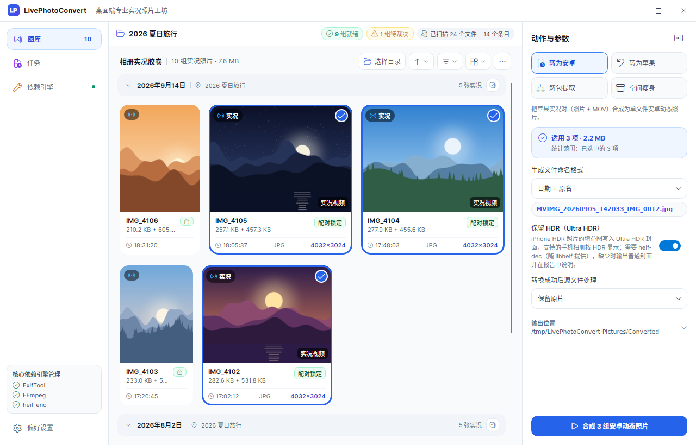
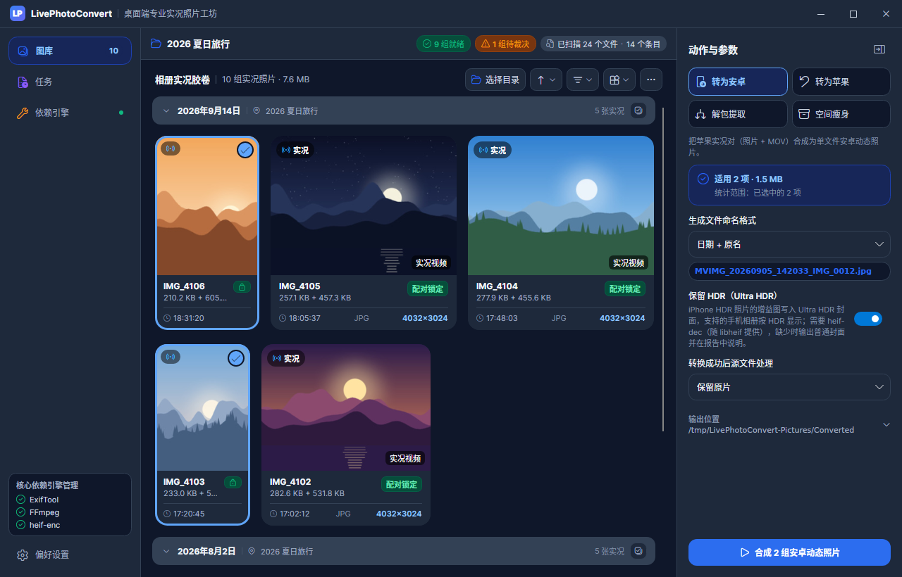
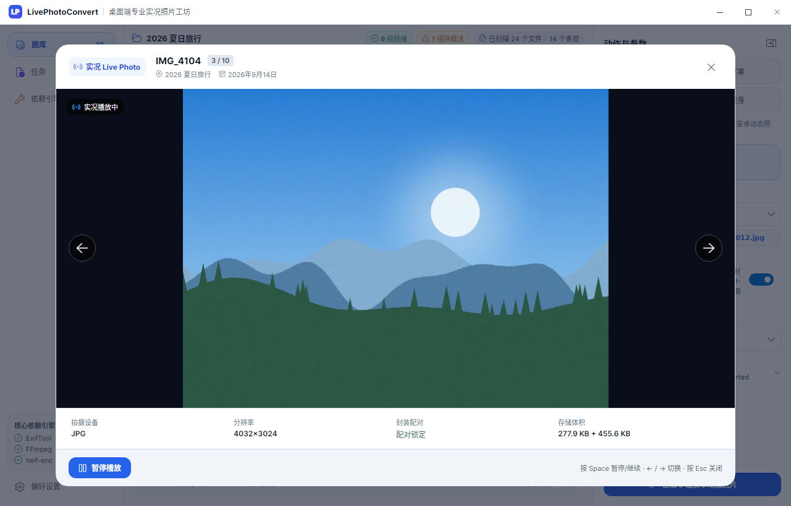
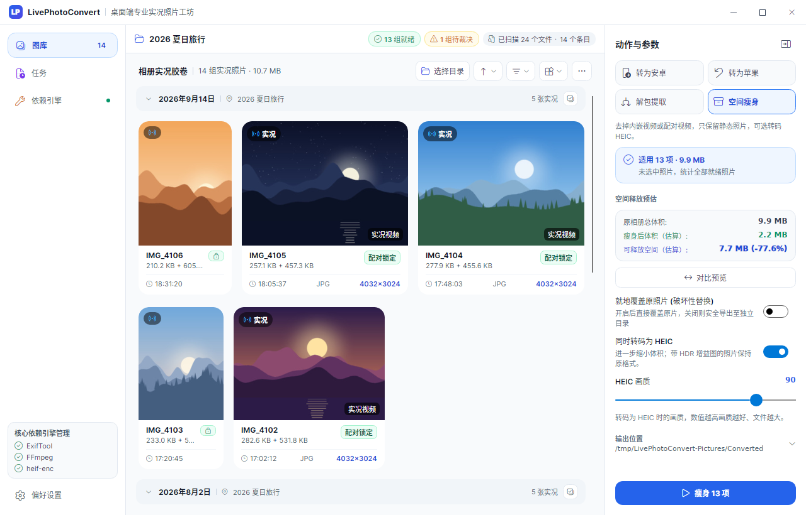
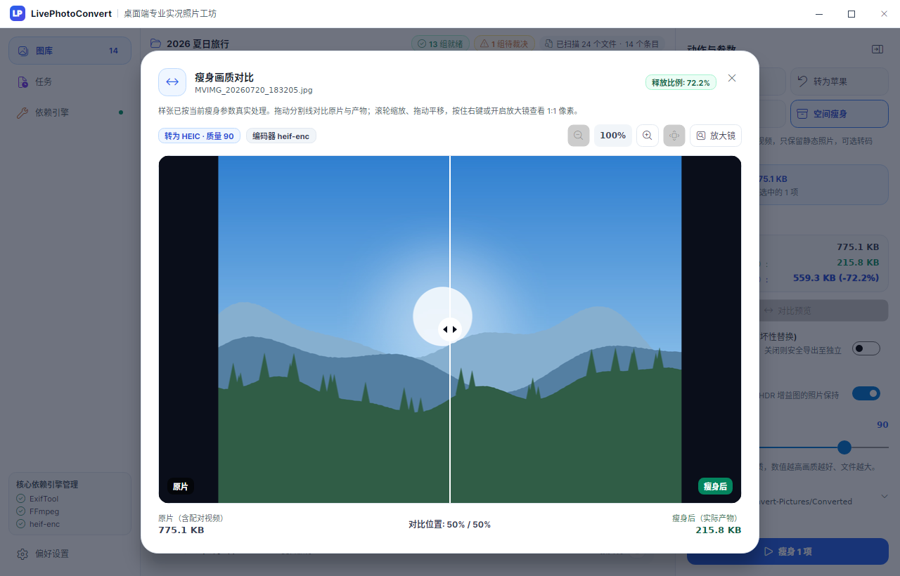
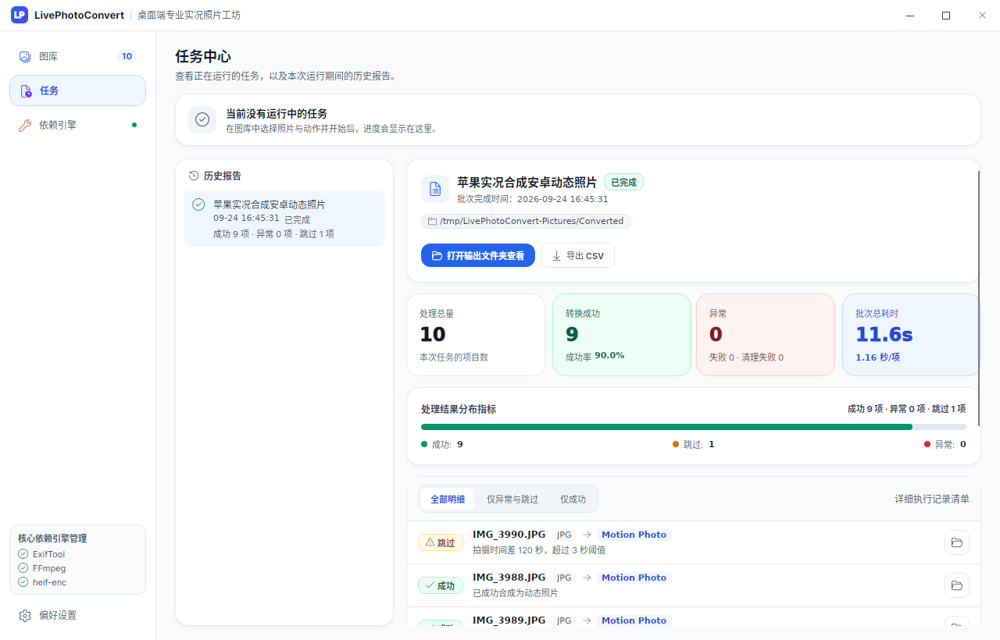
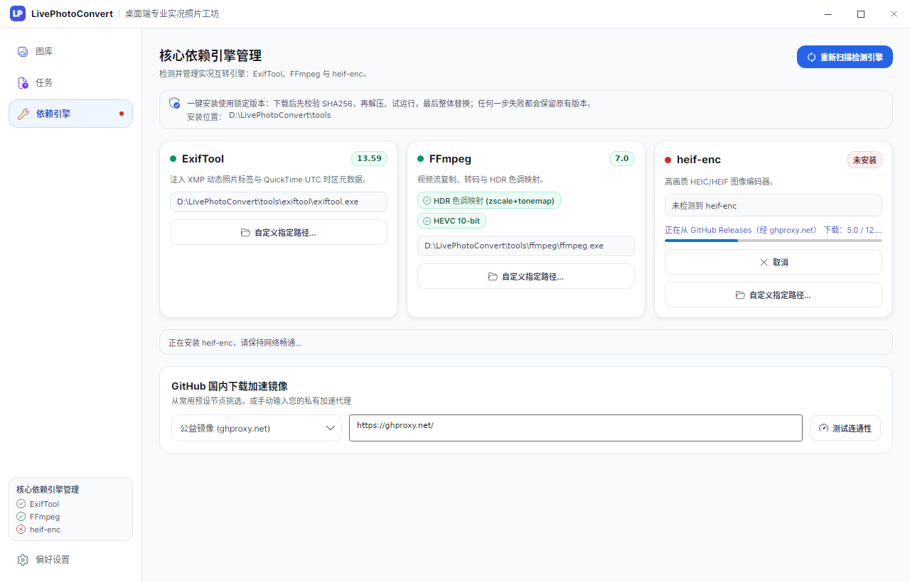
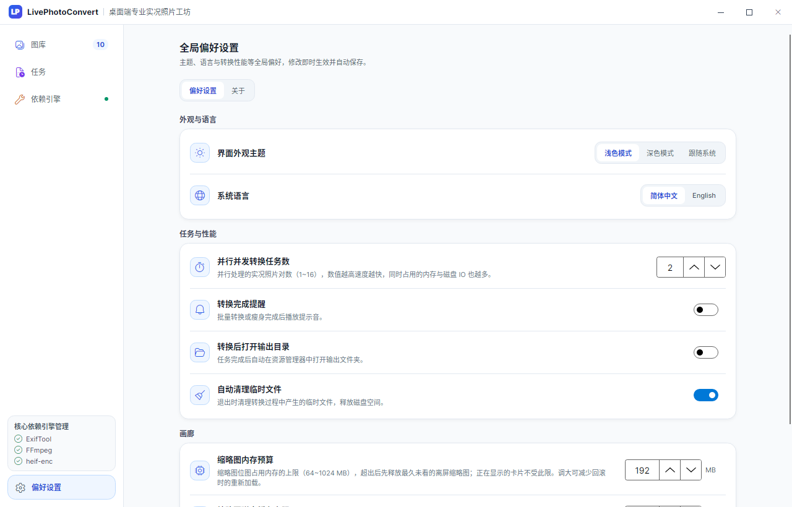

# LivePhotoConvert

<p align="center">
  
</p>

<p align="center">
  <strong>实况照片工作台：浏览相册，在苹果实况与安卓动态照片之间互转，为相册瘦身，并保留 HDR 画质。</strong>
</p>

<p align="center">
  <a href="https://github.com/ZhiQiu-Kinsey/AppleLivePhotoConvert/releases"></a>
  
  <a href="https://dotnet.microsoft.com/download"></a>
  <a href="https://avaloniaui.net/"></a>
  <a href="https://github.com/ZhiQiu-Kinsey/AppleLivePhotoConvert/actions/workflows/ci.yml"></a>
  <a href="LICENSE"></a>
</p>

<p align="center">
  <b>简体中文</b> · <a href="docs/README.en.md">English</a>
</p>

<p align="center">
  
</p>

## 目录

- [功能概览](#功能概览)
- [与其它方式的对比](#与其它方式的对比)
- [快速上手](#快速上手)
- [快捷键](#快捷键)
- [安全与数据保护](#安全与数据保护)
- [格式与兼容性](#格式与兼容性)
- [平台支持](#平台支持)
- [常见问题](#常见问题)
- [从源码构建](#从源码构建)
- [许可证与致谢](#许可证与致谢)
- [赞赏支持](#赞赏支持)

## 功能概览

### 四个动作

在图库中选好照片（不选则作用于全部就绪项），在右侧检查器中选择动作并调整参数：

| 动作 | 输入 | 输出 |
| :--- | :--- | :--- |
| **转为安卓** | 苹果实况对（HEIC / JPG + MOV） | 单文件安卓动态照片（`MVIMG_*.jpg`），可在 Google 相册、小米 / 澎湃 OS 相册等长按播放 |
| **转为苹果** | 安卓动态照片 | 苹果实况对（`.HEIC` + `.MOV`），两端写入相同的配对标识，导入 iPhone / Mac「照片」后识别为实况 |
| **解包提取** | 安卓动态照片 | 封面图 + 独立 `.mp4`，按字节无损切出 |
| **空间瘦身** | 安卓动态照片、苹果实况对 | 去掉内嵌视频或配对视频，只保留照片，可选转码 HEIC（默认质量 90）；可导出到新目录，也可就地替换 |

### 图库与预览

- **统一扫描**：一次扫描识别苹果实况对、安卓动态照片与普通照片，切换动作只筛选不重扫；配对可疑（拍摄时间不一致等）的条目单独标出，由你确认后再处理。
- **等高排版**：按拍摄日、月、年分组，支持多种排序、小/中/大缩放与方形裁切；缩略图按屏幕缩放分档生成并缓存，方向正确、色彩统一为 sRGB。
- **实况预览**：鼠标停留在卡片上即播放实况视频；按空格打开 QuickLook 全窗预览，左右方向键切换。
- **HDR**：iPhone HDR 照片转为安卓动态照片时可保留为 Ultra HDR（检查器中的「保留 HDR」，默认开启）；HLG / PQ 视频预览经色调映射显示，不发灰；HDR 视频转码保持 10-bit 与色彩元数据。
- **瘦身对比**：对样张实际运行一次瘦身，用真实产物做卷帘对比，支持缩放与 1:1 放大镜；相册级预估按抽样的真实压缩比计算。

### 任务中心

转换在后台运行，可暂停、继续与取消，显示吞吐与剩余时间。完成后生成报告：按结果筛选、定位输出或源文件、重试失败项、导出 CSV。报告保留到程序关闭。

### 依赖引擎

转换依赖三个命令行工具：[ExifTool](https://exiftool.org/)（元数据）、[FFmpeg](https://ffmpeg.org/)（视频）与 [heif-enc](https://github.com/strukturag/libheif)（HEIC 编码，同包的 heif-dec 用于 HDR 增益图）。依赖页可一键安装锁定版本：下载后校验 SHA256，解压、试运行通过后才替换，失败不影响原有版本；也可指定已有的可执行文件。

<details>
<summary><b>更多截图</b></summary>

| | |
| :---: | :---: |
|  图库（深色） |  QuickLook 实况预览 |
|  空间瘦身与空间预估 |  瘦身画质对比 |
|  任务报告 |  依赖引擎 |
|  偏好设置 | |

</details>

## 与其它方式的对比

| | LivePhotoConvert | 手动使用 ExifTool / FFmpeg | 手机厂商的互传或换机工具 |
| :--- | :--- | :--- | :--- |
| 苹果实况 → 安卓动态照片 | 批量合成，写入 Google Motion Photo XMP 与小米相册所需的 Exif 标签 | 需要自行拼接文件、计算视频偏移并编写 XMP | 取决于厂商与系统版本 |
| 安卓动态照片 → 苹果实况 | 生成 HEIC + MOV，两端写入相同的 ContentIdentifier | 需要构造 Apple MakerNotes 与 QuickTime Keys，ExifTool 不能在没有 MakerNotes 的文件里直接创建 | 取决于厂商与系统版本 |
| 批量配对与校验 | 按 ContentIdentifier 或同名配对，校验拍摄时间差与视频时长，可疑项人工裁决 | 需要自己编写脚本 | 由工具自动处理，规则不公开 |
| iPhone HDR 照片 | 可转为 Ultra HDR 动态照片 | 需要另行换算增益图并写入两套元数据 | 取决于厂商与系统版本 |
| 原片保护 | 暂存后原子落盘，不覆盖本批次源文件，源文件处置在输出校验后执行 | 取决于脚本 | 通常只复制，不修改原片 |
| 浏览与预览 | 画廊、悬浮播放、QuickLook、瘦身对比 | 无 | 在手机相册中查看 |
| 运行环境 | Windows 电脑 | 任意装有工具的系统 | 手机，无需电脑 |

## 快速上手

1. **下载**：从 [Releases](https://github.com/ZhiQiu-Kinsey/AppleLivePhotoConvert/releases) 下载 `LivePhotoConvert-v<版本>-win-x64.zip`，解压到任意可写目录，运行 `LivePhotoConvert.exe`。程序为 Native AOT 编译，不需要安装 .NET 运行时；解压后请保持目录内文件在一起。
2. **安装依赖**：首次启动后打开「依赖引擎」页（Ctrl+3），为缺失的工具点击安装。各动作需要的工具如下：

   | 动作 | ExifTool | FFmpeg | heif-enc |
   | :--- | :---: | :---: | :---: |
   | 转为安卓 | 需要 | 需要 | 保留 HDR 时需要其中的 heif-dec |
   | 转为苹果 | 需要 | 需要 | 需要 |
   | 解包提取 | 需要 | — | — |
   | 空间瘦身 | 需要 | — | 转码 HEIC 时需要 |
   | 悬浮播放 / QuickLook | — | 需要 | — |

3. **准备照片**：iPhone 照片请用「导出未修改的原片」（照片 App → 分享 → 选项），每张实况得到同名的照片与 `.MOV`；安卓动态照片直接复制原文件即可。
4. **打开相册**：在图库中选择目录（Ctrl+O），或把文件夹拖进窗口。
5. **选择动作**：在检查器中选择动作、输出位置与参数；需要只处理部分照片时先在画廊中选中。
6. **开始**：点击检查器底部的开始按钮（或按 Enter）。进度与报告在「任务」页查看。

## 快捷键

| 范围 | 按键 | 作用 |
| :--- | :--- | :--- |
| 全局 | Ctrl+O | 选择相册目录（任意页面，先切回图库） |
| 全局 | F5 | 重新扫描当前相册 |
| 全局 | Enter | 开始检查器中的当前动作（焦点在输入框或按钮上时交给该控件） |
| 全局 | Ctrl+1 / 2 / 3 / 4 | 切换到图库 / 任务 / 依赖引擎 / 偏好设置 |
| 画廊 | Ctrl+A | 全选 |
| 画廊 | Esc | 取消选择 |
| 画廊 | 空格 | 用 QuickLook 预览最近点选或悬停的照片 |
| 画廊 | 单击 / Ctrl+单击 / Shift+单击 | 单选 / 多选 / 范围选择 |
| 画廊 | 双击 | 打开 QuickLook |
| 弹窗 | Esc | 关闭当前弹窗 |
| QuickLook | 空格 | 播放 / 暂停 |
| QuickLook | ← / → | 上一张 / 下一张 |

macOS 键盘上的 Command 键按 Ctrl 处理。

## 安全与数据保护

- **不直接修改原文件**：外部工具只处理程序自己生成的中间文件；中间文件放在系统临时目录下的 `LivePhotoConvert\temp-*`，默认在程序退出时清理；异常退出留下的目录超过 24 小时后在启动时清理。
- **原子落盘**：输出先写到目标目录内以 `~lpc-` 开头的暂存文件，校验通过后在同一磁盘上重命名为最终文件；失败或取消时不会留下写了一半的文件。
- **不覆盖源文件**：同一批次的输出文件名统一分配，无论选择「追加序号」还是「覆盖」，都不会覆盖本批次的源文件或本批次已写出的文件。成对输出（HEIC + MOV）要么都落盘，要么都回滚；覆盖已有文件时先备份，失败会还原。
- **就地替换**：就地瘦身需要单独确认。替换时先保留 `.livephoto_backup` 备份，替换成功后立即删除；扩展名改变（JPG → HEIC）时先写入新文件，再删除原文件，删除失败会撤销新文件。
- **源文件处置时机**：「移入备份文件夹」「移入回收站」「永久删除」只在输出落盘并校验通过后执行。永久删除需要输入 `DELETE` 确认。移入备份文件夹时，源文件移到其所在目录下的「已合成」或「已拆分」子文件夹。
- **配对视频**：就地瘦身苹果实况对时，配对的 MOV 只有通过配对校验后才会被移入回收站，从不永久删除；导出模式不触碰 MOV。
- **磁盘空间**：开始前检查输出盘剩余空间（源文件总量的 1.2 倍再加 500 MB），不足时提示，可选择仍然继续。
- **时间戳与元数据**：输出文件沿用源文件的时间戳，EXIF、GPS 等元数据随转换复制。

## 格式与兼容性

**识别的输入**

- 苹果实况对：同一目录下同名的照片与视频（照片 `.heic` / `.jpg` / `.jpeg` / `.png`，视频 `.mov` / `.mp4`），或 ContentIdentifier 相同的照片与视频（文件名被网盘改过也能配上）。同名的多个候选按 HEIC > JPG > PNG、MOV > MP4 的顺序择优。
- 配对校验：ContentIdentifier 一致直接通过；否则要求拍摄时间差不超过 3 秒、视频不超过 30 秒。不满足的配对标为待裁决，确认属于同一张实况后才会处理。
- 安卓动态照片：带 Google Motion Photo / MicroVideo XMP 的 JPEG（含 Ultra HDR 增益图的照片）、三星动态照片、内嵌 `mpvd` 视频的 HEIC。只有增益图、没有视频的 Ultra HDR 照片按普通照片处理。

**输出**

| 动作 | 文件 | 说明 |
| :--- | :--- | :--- |
| 转为安卓 | `MVIMG_<原名>.jpg`、`MVIMG_<日期_时间>_<原名>.jpg` 或 `MVIMG_<日期_时间>.jpg` | JPEG 封面 + 尾部 MP4；写入 Google Motion Photo XMP（`GCamera:MotionPhoto*`、`MicroVideo*` 与 `Container:Directory`）和小米相册识别所需的 Exif `0x8897`；封面帧时间戳取自 MOV 的静态图时间轨道；非 MP4 视频重新封装为 MP4，前置摄像头的镜像视频重新编码以修正方向 |
| 转为苹果 | `<原名>.HEIC` + `<原名>.MOV` | JPEG 封面转码为 HEIC；照片的 Apple MakerNotes 与视频的 QuickTime Keys 写入同一个 ContentIdentifier，并同步拍摄时间、机型与位置 |
| 解包提取 | `<原名>.jpg` / `.heic` + `<原名>.mp4` | 按字节切出，不重新编码 |
| 空间瘦身 | 原格式或 `.heic` | 转码后的 HEIC 不比原格式小时保留原格式，只剥离视频；带增益图的照片保持原格式以保留 HDR |

**HDR**

- **iPhone HDR → Ultra HDR**：合成时把 HEIC 中的 Apple HDR 增益图换算为 Ultra HDR（ISO 21496-1 与 Google `hdrgm` 两套元数据）并写入封面，支持的安卓相册按 HDR 显示。源图没有 Apple 增益图、只有 iOS 18 起可能出现的 ISO `tmap` 增益图、或缺少 heif-dec 时输出普通封面，报告中注明原因。
- **转为苹果时不保留增益图**：还原的 HEIC 为标准动态范围。
- **视频**：HDR 视频需要转码时使用 libx265 10-bit，保留色彩三元组与 HDR10 元数据；HEVC 输出标记为 `hvc1` 以便 iOS 播放。

## 平台支持

| 平台 | 状态 |
| :--- | :--- |
| Windows 10 / 11 x64 | 正式支持，提供发布包 |
| Linux x64 | 可从源码运行，没有发布包。ExifTool、FFmpeg 与 libheif（heif-enc / heif-dec）需通过系统包管理器安装，依赖页不提供下载；回收站不可用，「移入回收站」会失败并记入报告，就地瘦身时配对的 MOV 会保留 |
| macOS | 未适配：当前引用的 Magick.NET x64 包不覆盖 Apple Silicon，发布包未做签名与公证，也没有经过真机验证 |
| Android / iOS | 不支持：转换依赖在本机启动 ExifTool、FFmpeg 等命令行工具进程 |

## 常见问题

<details>
<summary><b>依赖下载失败怎么办？</b></summary>

ExifTool 与 FFmpeg 优先从 npmmirror 国内镜像下载；heif-enc 与部分备用源来自 GitHub Releases，经依赖页中的加速镜像（默认 `ghproxy.net`，可选其它预设或自定义地址）下载，可先用「测试连通性」检查。无论经过哪个镜像，文件都按清单中的 SHA256 校验，不一致即放弃。

仍然失败时，可以手动下载后在工具卡片上「自定义指定路径」，或把可执行文件放到程序目录的 `tools\<工具名>\`（如 `tools\ffmpeg\ffmpeg.exe`）下，或加入 `PATH`，然后点击「重新扫描检测引擎」。
</details>

<details>
<summary><b>HDR 视频预览发灰或提示无法显示？</b></summary>

HLG / PQ 视频需要 FFmpeg 的 zscale 与 tonemap 滤镜做色调映射。依赖页一键安装的 FFmpeg 都带这两个滤镜；如果指定了自己的 FFmpeg，依赖页会显示「HDR 色调映射」能力是否可用，缺少时 QuickLook 会提示并可跳转到依赖页。预览显示的是映射到 SDR 的画面，不是 HDR 直出。
</details>

<details>
<summary><b>瘦身转 HEIC 后为什么有的照片仍是 JPG？</b></summary>

转码后的 HEIC 不比原格式小时（例如噪点很多或已经高度压缩的 JPEG），程序保留原格式，只剥离视频，报告中该条目标注「保留原格式（HEIC 更大）」。带 Ultra HDR 增益图的照片也保持原格式，避免丢失 HDR。
</details>

<details>
<summary><b>卡片上显示「拍摄时间不吻合」是什么意思？</b></summary>

照片与同名视频的拍摄时间相差超过 3 秒、视频超过 30 秒，或只有一边带拍摄时间时，程序无法确认它们属于同一张实况，这些条目不参与转换。点击卡片上的标记打开裁决弹窗，对比照片与视频首帧：确认属于同一张实况后加入本次处理，否则保持拆开。
</details>

<details>
<summary><b>合成后的照片在安卓手机上不动？</b></summary>

请用数据线、局域网传输或网盘原图传到手机；聊天软件通常会重新压缩图片并丢弃尾部视频。传入后如相册仍显示为普通照片，可等待系统媒体库重新扫描。
</details>

<details>
<summary><b>还原的实况照片导入 iPhone 后不是实况？</b></summary>

同名的 `.HEIC` 与 `.MOV` 需要一起导入「照片」图库（例如在 Mac「照片」中同时导入两个文件），「照片」按两端相同的 ContentIdentifier 把它们识别为一张实况。只导入其中一个文件或经过会改写文件的中转都会失去配对。
</details>

<details>
<summary><b>大相册占用内存较多，或缓存占用磁盘空间？</b></summary>

在「偏好设置 → 画廊」中调整缩略图内存预算（64～1024 MB，默认 192 MB）与磁盘缓存上限（128 MB～16 GB，默认 1 GB），并可查看占用、清理缓存。正在显示的卡片不受预算限制；清理缓存后缩略图会按需重新生成。
</details>

<details>
<summary><b>设置、日志和缓存保存在哪里？</b></summary>

| 内容 | 位置（Windows） |
| :--- | :--- |
| 设置 | `%AppData%\LivePhotoConvert\settings.json`（无法解析时改名为 `settings.json.corrupt` 并使用默认值） |
| 错误日志 | `%LocalAppData%\LivePhotoConvert\logs\` |
| 缩略图缓存 | `%LocalAppData%\LivePhotoConvert\cache\thumbnails\` |
| 一键安装的工具 | 程序目录下的 `tools\`；程序目录不可写时为 `%LocalAppData%\LivePhotoConvert\tools\` |
| 临时文件 | `%TEMP%\LivePhotoConvert\` |
</details>

<details>
<summary><b>Windows 提示「已保护你的电脑」？</b></summary>

发布包没有代码签名，首次运行时 SmartScreen 可能提示，可在「更多信息」中选择仍要运行。下载后可用 Release 中的 `SHA256SUMS.txt` 核对文件，或用 `gh attestation verify <zip> -R ZhiQiu-Kinsey/AppleLivePhotoConvert` 验证构建来源证明。
</details>

## 从源码构建

需要 [.NET 10 SDK](https://dotnet.microsoft.com/download)（版本由 `global.json` 固定）。

```bash
dotnet build LivePhotoConvert.slnx          # 编译
dotnet test LivePhotoConvert.slnx           # 全部测试；缺少外部工具时相关集成测试自动跳过
dotnet run --project src/LivePhotoConvert.Desktop/LivePhotoConvert.Desktop.csproj

# Windows x64 Native AOT 发布
dotnet publish src/LivePhotoConvert.Desktop/LivePhotoConvert.Desktop.csproj -r win-x64 -c Release -o dist/aot
```

代码结构与开发约定见 [AGENTS.md](AGENTS.md)，各子系统的设计说明见 [docs/design](docs/design/README.md)，版本历史见 [CHANGELOG.md](CHANGELOG.md)。

README 中的截图由界面测试生成（需要 FFmpeg；有 heif-enc 时瘦身预估使用真实编码）：

```bash
LPC_DOCS_SCREENSHOTS=docs/screenshots dotnet test tests/LivePhotoConvert.Desktop.Tests --filter "FullyQualifiedName~ReadmeScreenshotTests"
```

## 许可证与致谢

本项目以 [MIT 许可证](LICENSE) 开源。

程序在运行时调用或内置以下项目，感谢它们的作者（与应用内「偏好设置 → 关于」的清单一致）：

- [ExifTool](https://exiftool.org/)：元数据读写
- [FFmpeg](https://ffmpeg.org/)：视频封装、转码与播放解码
- [libheif](https://github.com/strukturag/libheif) / [x265](https://www.videolan.org/developers/x265.html)：HEIC 编解码（heif-enc、heif-dec）
- [Magick.NET](https://github.com/dlemstra/Magick.NET)：图像解码与缩略图

构建所用的框架与规范：

- [.NET](https://dotnet.microsoft.com/)：运行时与 Native AOT 工具链
- [Avalonia UI](https://avaloniaui.net/)：跨平台桌面界面框架
- [CommunityToolkit.Mvvm](https://github.com/CommunityToolkit/dotnet)：MVVM 源生成器
- [FluentIcons.Avalonia](https://github.com/davidxuang/FluentIcons)：Fluent 图标
- [Google Motion Photo 格式规范](https://developer.android.com/media/platform/motion-photo-format)

外部工具按各自的许可证分发，一键安装时从其官方或镜像来源下载，不随本程序打包。

## 赞赏支持

如果这个工具对你有帮助，欢迎请作者喝杯咖啡。

<p align="center">
  
</p>

<p align="center">
  <sub>微信扫一扫赞赏</sub>
</p>

也欢迎点亮 Star、在 [Issues](https://github.com/ZhiQiu-Kinsey/AppleLivePhotoConvert/issues) 反馈问题，或提交 [Pull Request](https://github.com/ZhiQiu-Kinsey/AppleLivePhotoConvert/pulls)。
