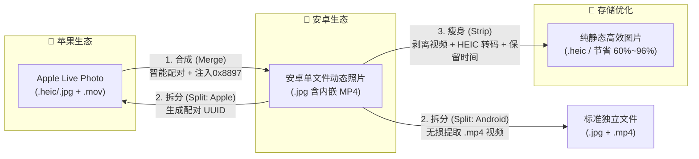

# LivePhotoConvert (动态照片工具箱)

<p align="center">
  
</p>

<p align="center">
  <strong>⚡ 苹果实况照片 (Apple Live Photo) 与安卓动态照片 (Motion Photo) 双向高保真转换 & 批量瘦身工具箱</strong>
</p>

<p align="center">
  <a href="https://github.com/ZhiQiu-Kinsey/AppleLivePhotoConvert/releases/latest"></a>
  <a href="https://dotnet.microsoft.com/download"></a>
  
  
  <a href="https://github.com/ZhiQiu-Kinsey/AppleLivePhotoConvert/actions/workflows/ci.yml"></a>
  <a href="LICENSE"></a>
</p>

<p align="center">
  <a href="README.md"><b>简体中文</b></a> • <a href="docs/README.en.md"><b>English</b></a>
</p>

---

## 🎯 业务流程全景



---

## 🌟 核心功能矩阵

| 功能模块 | 命令 / 菜单 | 输入格式 | 输出效果 | 核心价值 |
| :--- | :--- | :--- | :--- | :--- |
| **实况合成** | `merge`<br/>`1. 合成动态照片` | `HEIC/JPG` + `MOV`<br/>(iPhone 导出) | 单文件安卓动态照片 (`.jpg`) | 完美适配**小米相册 (澎湃 OS / MIUI)、Google 相册、Windows 11 照片**等动态长按播放 |
| **标准拆分** | `split -f android`<br/>`2. 拆分动态照片` | 安卓动态照片 (`.jpg/.heic`) | 封面图 + 原生视频 (`.jpg/.heic` + `.mp4`) | 原生无损截取，适合通用视频剪辑、备份与全平台播放 |
| **实况重构** | `split -f apple`<br/>`2. 拆分动态照片` | 安卓动态照片 (`.jpg/.heic`) | 苹果实况照片 (`.jpg/.heic` + `.mov`) | 自动生成并注入双向配对 `ContentIdentifier`，**可直接导回 iPhone/Mac 相册长按动态播放** |
| **瘦身优化** | `strip`<br/>`3. 瘦身优化` | 安卓动态照片 (`.jpg/.heic`) | 极小纯图片 (`.heic` 或纯 `.jpg`) | **剥离内嵌视频并转 HEIC**，释放 **60%~96%** 存储空间，**100% 保持原始文件修改时间与拍摄元数据** |

---

## ⚡ 技术亮点

- ⚡ **无损流复制与极速转码**：
  - 视频优先采用无损流复制（`-c:v copy`），音频自动封装为标准 AAC，**毫秒级极速处理且画质 0 损失**；
  - 自动识别 iPhone 前置自拍镜像矩阵，自适应处理旋转与镜像，杜绝视频方向颠倒。
- 🗜️ **工业级 HEIC 编码与极限空间释放**：
  - 集成 `heif-enc`（基于 `libheif / x265`）高质量独立编码器，在纯图基础上进一步缩减 50%~70% 体积；
  - **实测数据（100 张真实小米动态照片）**：总体积从 `603.46 MB` 压缩至 `194.12 MB`，**净释放 409.34 MB (压缩率 67.8%)**；
  - **绝对时间戳保真**：精确捕获并还原文件系统的 `CreationTime` 与 `LastWriteTime`，相册时间线与排序丝毫不乱。
- 🚀 **Native AOT 极致轻量与零依赖**：
  - 基于 .NET 10 **Native AOT** 纯原生机器码编译，免安装 .NET 运行时，冷启动仅需数十毫秒。
- 📥 **外部依赖全自动一键就绪**：
  - 内置国内加速镜像（阿里云 CDN、GitHub 镜像代理），首次运行自动检测并一键静默下载配置 `ExifTool`、`FFmpeg` 与 `heif-enc`。
- 🖥️ **现代化双模体验**：
  - **交互模式**：Spectre.Console 彩色终端向导，集成 **Windows 原生每显示器高分屏 (PerMonitorV2) 文件夹选择器** 与拖拽支持；
  - **CLI 模式**：全功能参数支持，提供静默确认、并发数调节，极易集成到 NAS 自动化与批处理脚本中。

---

## 📸 运行预览

<p align="center">
  
</p>

---

## 🚀 快速上手

### 1. 下载程序
前往 [Releases 页面](https://github.com/ZhiQiu-Kinsey/AppleLivePhotoConvert/releases) 下载最新的 `LivePhotoConvert` 绿色免安装压缩包并解压。

### 2. 准备源文件
- **iPhone 实况照片**：在 iPhone【照片】App 中选中照片 $\rightarrow$ 点击【分享】 $\rightarrow$ 【保存到“文件”】或【导出未修改的原片】（每张实况将包含图片与同名 `.MOV` 视频）。
- **安卓动态照片**：直接从小米、OPPO、vivo 或 Google Pixel 手机中导出的包含内嵌视频的 `.jpg` 照片。

### 3. 开始转换
直接双击运行 `LivePhotoConvert.exe`：
- **首次运行**：程序将自动检测外部工具，缺失时按回车即可一键全自动下载就绪；
- **按需选择**：根据彩色菜单提示选择 `1. 合成`、`2. 拆分` 或 `3. 瘦身`，按弹窗选取目录即可完成批量处理。

---

## 💻 命令行使用指南 (CLI)

除交互菜单外，程序提供丰富的 CLI 命令行接口，便于脚本自动化与批处理调用：

```bash
# ==================== 1. 合成模式 (Merge) ====================
# 将 iPhone 导出的照片和 MOV 视频合成为安卓动态照片
LivePhotoConvert merge -i "D:\Photos" -o "D:\MotionPhotos"

# 合成后将已匹配的原始文件移动到子目录（静默确认）
LivePhotoConvert merge -i "D:\Photos" -o "D:\MotionPhotos" -s move -y

# ==================== 2. 拆分模式 (Split) ====================
# 拆分为标准安卓格式 (.jpg + .mp4)
LivePhotoConvert split -i "D:\MotionPhotos" -o "D:\Output" -f android

# 拆分并重构成苹果实况格式 (.jpg + .mov，注入配对 UUID)
LivePhotoConvert split -i "D:\MotionPhotos" -o "D:\AppleLivePhotos" -f apple

# ==================== 3. 瘦身模式 (Strip) ====================
# 就地修改：剥离内嵌视频 + 转 HEIC（最省空间，100% 保留修改时间）
LivePhotoConvert strip -i "D:\Photos"

# 输出到新目录（保留原文件不修改）
LivePhotoConvert strip -i "D:\Photos" -o "D:\Optimized"

# 仅剥离内嵌视频，保持原始 JPG 格式（不转 HEIC）
LivePhotoConvert strip -i "D:\Photos" --no-heic

# 自定义 HEIC 压缩质量（默认 65，可设 1-100）
LivePhotoConvert strip -i "D:\Photos" -q 75

# ==================== 4. 依赖管理 (Tools) ====================
# 提前检查并一键下载所有依赖组件 (ExifTool / FFmpeg / heif-enc)
LivePhotoConvert tools --auto-download
```

### CLI 参数选项一览表

| 选项 | 别名 | 适用命令 | 默认值 | 说明 |
| :--- | :---: | :---: | :---: | :--- |
| `--input <目录>` | `-i` | 全部 | *(弹窗选择)* | 输入目录路径（省略时自动弹出 Windows 原生文件夹选择框） |
| `--output <目录>` | `-o` | 全部 | *(就地/弹窗)* | 输出目录路径（`strip` 省略时为就地修改覆盖模式） |
| `--format <格式>` | `-f` | `split` | `android` | 拆分目标格式：`android`（标准安卓格式）或 `apple`（苹果实况照片） |
| `--no-heic` | | `strip` | `false` | 跳过 HEIC 格式转换，仅剥离动态照片中的内嵌视频 |
| `--quality <数值>` | `-q` | `strip` | `65` | HEIC 压缩质量 (1–100，65 兼顾画质无损与极小体积) |
| `--source-action <方式>`| `-s` | `merge` | `keep` | 合成成功后原始文件处理：`keep`（保留）、`move`（移动）、`recycle`（回收站）、`delete`（永久删除） |
| `--no-verify` | | `merge` | `false` | 跳过智能配对校验，强制仅按文件名匹配 |
| `--parallel <数量>` | `-p` | 全部 | *(自动调优)* | 并行并发处理任务数（默认根据 CPU 核心数自动调优） |
| `--overwrite` | | 全部 | `false` | 输出目录存在同名文件时直接覆盖（默认自动追加 `_1`、`_2` 后缀） |
| `--auto-download` | | 全部 | `false` | 缺少外部依赖工具时自动通过加速镜像静默下载安装 |
| `--mirror <前缀>` | | `tools` | *(内置)* | 自定义 GitHub 镜像代理前缀（如 `https://ghfast.top/`） |
| `--exiftool <路径>` | | 全部 | *(自动定位)* | 显式指定 ExifTool 可执行文件路径 |
| `--ffmpeg <路径>` | | 全部 | *(自动定位)* | 显式指定 FFmpeg 可执行文件路径 |
| `--heif-enc <路径>` | | `strip` / 全部 | *(自动定位)* | 显式指定 heif-enc 可执行文件路径 |
| `--yes` | `-y` | 全部 | `false` | 跳过开始前的交互确认提示，便于脚本自动化执行 |

> [!NOTE]
> **进程退出码定义**：`0` 全部成功，`1` 执行异常，`2` 参数错误，`3` 用户主动取消，`4` 部分文件处理失败。

---

## 🔬 技术原理与逆向解析

### 1. 安卓动态照片存储机制
标准安卓动态照片遵循 [Google Motion Photo 规范](https://developer.android.com/media/platform/motion-photo-format?hl=zh-cn)，将封面图片与 MP4 视频直接进行二进制流物理拼接（图片在前，视频在后），并通过 XMP 命名空间注入元数据：
* `GCamera:MicroVideo = 1`：声明该图片包含微视频数据。
* `GCamera:MicroVideoOffset`：内嵌视频在文件尾部的字节偏移量。
* `GCamera:MicroVideoPresentationTimestampUs`：实况照片代表帧的时间戳（微秒）。

### 2. 小米相册 `0x8897` 专属标识逆向发现
在早期测试中，仅写入 Google 标准 XMP 标签的照片在小米手机上无法触发动态效果。通过使用 `jadx-gui` 逆向反编译小米相册官方 APK 的动态照片识别逻辑：

<p align="center">
  
</p>

逆向发现小米相册在底层通过读取 Exif 专属标签判定动态照片：
* 代码中匹配十进制常数 `34967`，换算为十六进制即 **`0x8897`**。
* 本程序使用 ExifTool 自动配置并注入该特殊标签，完美解决了小米澎湃 OS（Xiaomi HyperOS / MIUI）相册无法识别的问题。

### 3. Apple Live Photo 配对标识机制
苹果实况照片依赖全局唯一的 UUID 进行双向绑定：
* **图片端**：在 MakerNotes 或 Exif 注入 `ContentIdentifier`。
* **视频端**：在 QuickTime MOV 容器的 `com.apple.quicktime.content.identifier` 注入相同 UUID，并设置 `still-image-time = 0`。
* 拆分选择 `apple` 格式时，程序会自动生成配对 UUID 并完成双向元数据写入，确保导入 iOS / macOS 照片库后可正常长按动态播放。

### 4. 瘦身优化与时间戳保真机制
* **无损定界截取**：通过 ExifTool 读取 `MicroVideoOffset` 得到视频长度，利用流式文件复制精准截断尾部视频字节，再通过 ExifTool 彻底抹除动态照片标记；
* **HEIC 独立编码**：采用 `heif-enc` 外部独立编码器（基于 `libheif / x265`）生成符合 ISO/IEC 23008-12 规范的 `.heic` 容器，完整保留原图 EXIF（拍摄时间、GPS、镜头参数等）；
* **时间戳预捕获还原**：在就地覆盖修改前预先读取并固化原始文件的 `CreationTime` 与 `LastWriteTime`，转码完成后重新写回，杜绝文件被修改为当前操作时间。

---

## 🛠️ 项目结构与本地构建

### 架构布局
```
src/
  LivePhotoConvert.Core/       # 纯净核心库：格式嗅探、二进制拼接、元数据编解码、外部工具驱动（0 第三方依赖）
  LivePhotoConvert.Cli/        # 控制台程序：Spectre.Console 交互界面、CLI 参数解析、进度渲染
tests/
  LivePhotoConvert.Core.Tests/ # 全套自动化单元测试（覆盖解包、嗅探、配对、瘦身与清理）
```

### 编译运行
本项目基于 **.NET 10.0** 与 C# 13 构建：

```bash
# 1. 还原并编译解决方案
dotnet build LivePhotoConvert.slnx

# 2. 运行自动化测试套件 (90 个测试用例)
dotnet test LivePhotoConvert.slnx

# 3. 发布为 Native AOT 绿色运行包
dotnet publish src/LivePhotoConvert.Cli/LivePhotoConvert.Cli.csproj /p:PublishProfile=win-x64-aot -o dist/aot
```

---

## 💖 致谢与开源项目引用

本项目由衷感谢以下优秀的开源工具与项目支持：

* [ExifTool by Phil Harvey](https://exiftool.org/) - 强大的多格式媒体元数据读写引擎
* [FFmpeg](https://ffmpeg.org/) - 领先的多媒体音视频处理框架
* [libheif](https://github.com/strukturag/libheif) & [x265](https://www.videolan.org/developers/x265.html) - 高性能 HEIF / HEIC 图像编解码库
* [Magick.NET / ImageMagick](https://github.com/dlemstra/Magick.NET) - 强大的图像处理库
* [Spectre.Console](https://github.com/spectreconsole/spectre.console) - 优雅强大的 .NET 终端 UI 渲染库
* [Google Motion Photo Specification](https://developer.android.com/media/platform/motion-photo-format) - 安卓动态照片规范

---

## 📄 开源许可证

本项目基于 [MIT 许可证](LICENSE) 开源。欢迎提交 Issue 或 Pull Request 为项目贡献力量！
