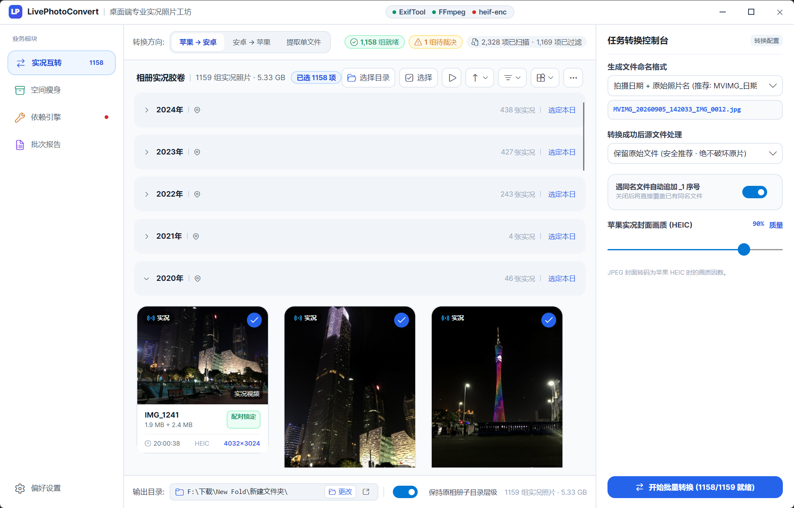
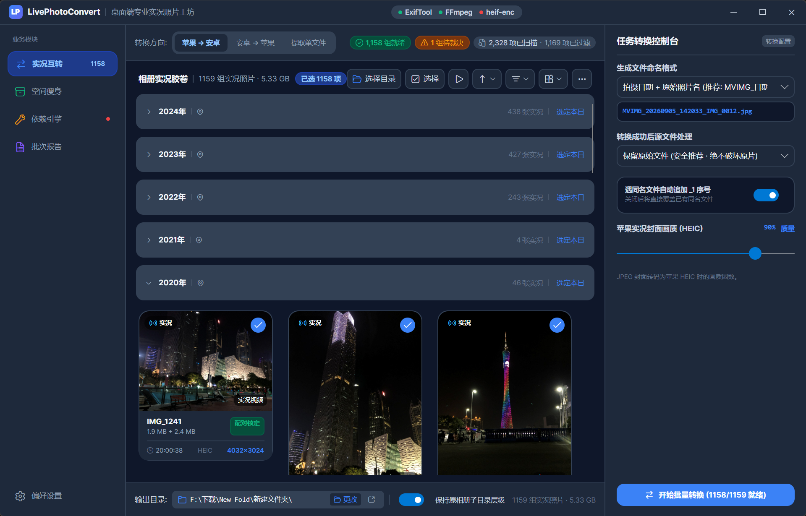
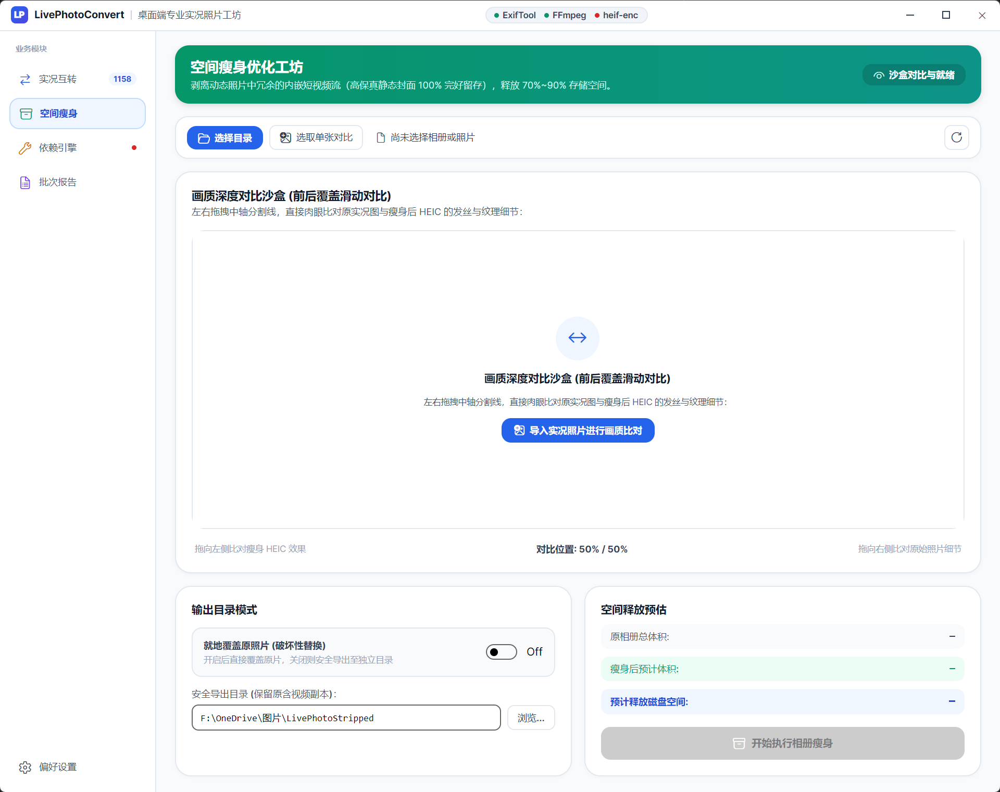
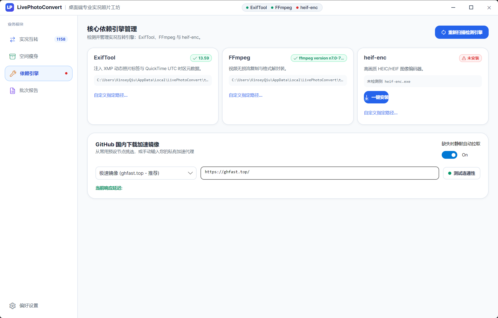
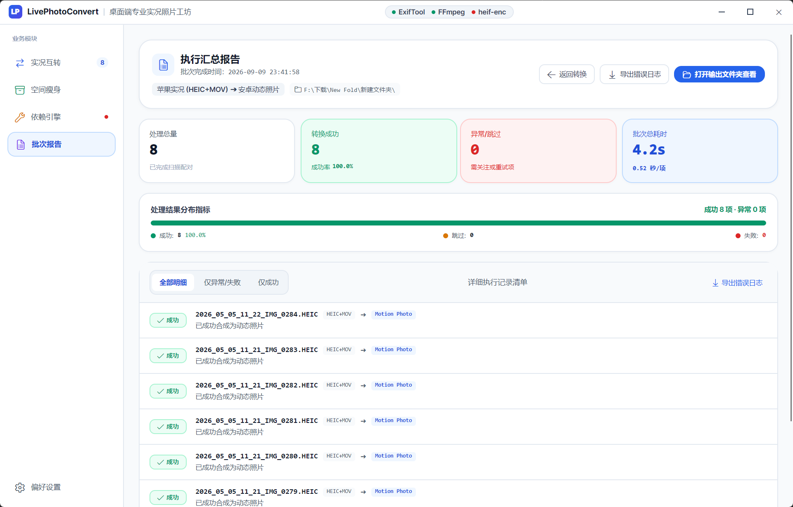
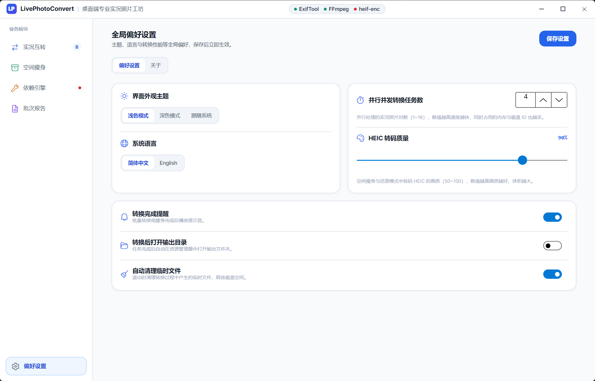
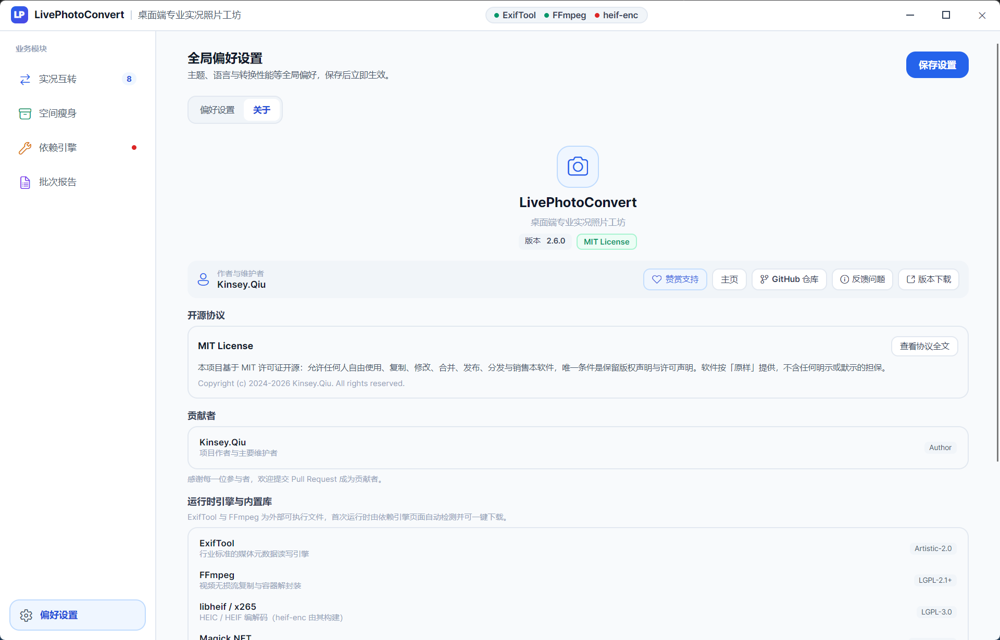

# LivePhotoConvert (动态照片工具箱)

<p align="center">
  
</p>

<p align="center">
  <strong>⚡ 跨生态动态照片工作台：苹果实况 (Live Photo) 与安卓动态照片 (Motion Photo) 双向无损互转、相册批量瘦身</strong>
</p>

<p align="center">
  <a href="https://dotnet.microsoft.com/download"></a>
  <a href="https://avaloniaui.net/"></a>
  
  
  <a href="https://github.com/ZhiQiu-Kinsey/AppleLivePhotoConvert/actions/workflows/ci.yml"></a>
  <a href="LICENSE"></a>
</p>

<p align="center">
  <a href="README.md"><b>简体中文</b></a> • <a href="docs/README.en.md"><b>English</b></a>
</p>

> [!IMPORTANT]
> 自 v2.6 起项目已从命令行工具全面转型为 **Avalonia 桌面应用**：CLI 入口（`LivePhotoConvert.Cli` 与 Spectre.Console 交互菜单）已移除，全部能力由图形界面提供，底层引擎沉淀在纯托管的 `LivePhotoConvert.Core` 类库中。

---

## 📖 目录

- [🔄 核心特性](#-核心特性)
- [📱 转换场景与兼容性矩阵](#-转换场景与兼容性矩阵)
- [📸 界面预览](#-界面预览)
- [🚀 快速上手](#-快速上手)
- [🖥️ 桌面端功能详解](#️-桌面端功能详解)
- [🔬 核心技术与底层逆向](#-核心技术与底层逆向)
- [❓ 常见问题与排坑指南 (FAQ)](#-常见问题与排坑指南-faq)
- [🛠️ 项目架构与本地构建](#️-项目架构与本地构建)
- [💖 致谢与开源项目引用](#-致谢与开源项目引用)
- [☕ 赞赏支持](#-赞赏支持)
- [📄 开源许可证](#-开源许可证)

---

## 🔄 核心特性

- 🔄 **跨生态双向转换**
  - **合成（实况互转 · 苹果 → 安卓）**：将 iPhone 实况照片（`HEIC/JPG` + `MOV`）合成为单文件安卓动态照片（`.jpg`），支持小米澎湃 OS、Google 相册与 Windows 11 照片应用长按播放；
  - **还原（实况互转 · 安卓 → 苹果）**：将安卓动态照片拆分并注入配对 UUID（`ContentIdentifier`），导入 iPhone / Mac 相册即可恢复实况效果；
  - **解包（实况互转 · 提取单文件）**：无损提取动态照片的静态封面与内嵌微视频。
- 🗜️ **空间瘦身**：批量剥离动态照片内嵌视频并可选转码为高画质 HEIC（默认质量 90，视觉无损），实测释放 60%~96% 存储空间，拍摄时间戳与 EXIF 元数据 100% 保留。
- 🎯 **智能配对与人工裁决**：优先依据 `ContentIdentifier` UUID 精确配对；时间差超阈值的可疑对自动进入双屏仲裁弹窗，由人工确认或拆分。
- 🖼️ **相册级批量工作流**：虚拟化相册胶卷（按拍摄日期 / 月份 / 年份分组）、悬停实况预览、空格全屏 QuickLook、前后画质滑动对比。
- 🛡️ **多层安全防护**：磁盘空间预检（ENOSPC 预警）、物理删除二次确认锁、就地覆盖原子备份（`.livephoto_backup`）、临时目录自愈清理。
- ⚡ **Native AOT 原生性能**：.NET 10 Native AOT 单文件发布，毫秒级冷启动；核心引擎零分配流式处理（`ArrayPool` + 文件预分配），绝不整文件读入堆内存。
- 🌗 **浅色 / 深色主题 + 中英双语**：跟随系统或手动切换，设置内建「关于」页（版本、贡献者、开源协议与引用项目一览）。
- 📥 **依赖全自动托管**：ExifTool、FFmpeg、heif-enc 首次运行自动检测，内置国内加速镜像一键下载。

---

## 📱 转换场景与兼容性矩阵

| 模式 | 输入源文件 | 输出目标文件 | 兼容平台 / 播放支持 | 核心应用场景 |
| :--- | :--- | :--- | :--- | :--- |
| **合成**（苹果 → 安卓） | iPhone 导出片 (`HEIC/JPG` + `MOV`) | 单文件动态照片 (`MVIMG_*.jpg`) | 小米澎湃 OS / MIUI 相册<br>Google Photos<br>Windows 11 照片<br>三星相册 | 苹果换机至安卓，或需在 PC / 安卓上查看动态照片 |
| **还原**（安卓 → 苹果） | 安卓动态照片 (`.jpg/.heic`) | 苹果实况对 (`.HEIC` + `.MOV`) | iPhone 照片 App (iOS)<br>Mac 照片 App (macOS)<br>iCloud Web | 安卓换机至 iPhone，长按即可恢复实况动态效果 |
| **解包**（提取单文件） | 安卓动态照片 (`.jpg/.heic`) | 静态图片 + 视频 (`.jpg` + `.mp4`) | 全平台播放器、剪辑软件 (PR / 剪映) | 提取动态照片中的微视频素材进行剪辑或保存封面 |
| **空间瘦身** | 动态照片 / JPEG 图片 | 高画质 HEIC (`.heic`) 或纯 JPG | 全平台支持 HEIC 解码的系统与设备 | 手机相册空间告急，批量释放 60%~96% 存储 |

---

## 📸 界面预览

<p align="center">
  
</p>

<details>
<summary><b>更多界面截图</b></summary>

| 功能              | 截图                                               |
|:------------------|:---------------------------------------------------|
| 实况互转（浅色）  |  |
| 实况互转（深色）  |   |
| 空间瘦身          |              |
| 依赖引擎          |          |
| 批次报告          |         |
| 偏好设置          |           |
| 关于              |              |

</details>

---

## 🚀 快速上手

### 1. 下载程序

前往 👉 [Releases 页面](https://github.com/ZhiQiu-Kinsey/AppleLivePhotoConvert/releases) 下载最新的 `LivePhotoConvert-win-x64.zip` 绿色压缩包并解压至任意目录，双击 `LivePhotoConvert.exe` 即可运行（无需安装 .NET 运行时，Native AOT 单文件发布）。

### 2. 从 iPhone 导出实况原片

要合成安卓动态照片，请先导出**未修改的原片**：

1. 打开 iPhone【照片】App，多选需要导出的实况照片；
2. 点击左下角【分享】图标 → 上滑选择【**导出未修改的原片**】；
3. 保存到【文件】或通过数据线 / AirDrop / iCloud 传到电脑；
4. 每张实况照片对应两个同名文件（如 `IMG_1024.HEIC` 与 `IMG_1024.MOV`）。

### 3. 开始使用

1. **首次运行**：进入「依赖引擎」页，程序自动检测 ExifTool / FFmpeg / heif-enc，缺失时勾选「静默自动拉取」一键通过镜像下载；
2. **选择目录**：在「实况互转」页选择相册目录，程序自动扫描配对并给出可转换数量；
3. **执行转换**：按需切换转换方向（苹果 → 安卓 / 安卓 → 苹果 / 提取单文件），在右侧检查器调整输出选项后一键执行；
4. **查看报告**：转换完成后在「批次报告」页查看成败明细，可导出错误日志或单项强制补转。

---

## 🖥️ 桌面端功能详解

### 实况互转

- 左侧相册胶卷：虚拟化长列表，支持按拍摄日期 / 月份 / 年份分组折叠、排序、多选、悬停自动试播；
- 右侧检查器：转换方向、输出命名格式（原文件名 / 日期 + 原名 / 纯时间戳）、源文件处理策略（保留 / 归档子目录 / 回收站 / 物理删除）、HEIC 画质与子目录层级保持；
- 可疑配对仲裁：拍摄时间差超过 3 秒的候选对自动弹出双屏核验，同帧比对后人工裁决入白名单或拆分。

### 空间瘦身

- 三阶段工作流：待瘦身分析（含空间释放预估）→ 实时进度（吞吐速率 / 剩余时间）→ 成果汇报；
- 前后画质「拉幕对比」沙盒：拖拽分割线逐像素比对原图与瘦身后 HEIC；
- 支持安全导出目录与就地覆盖（后者需通过琥珀色高危确认弹窗，原子备份 `.livephoto_backup` 保障断电零损坏）。

### 依赖引擎

- ExifTool / FFmpeg / heif-enc 三引擎状态卡片与重新扫描；
- GitHub 国内加速镜像选择、连通性延迟测试、缺失自动下载。

### 批次报告

- 成功 / 失败 / 跳过分类明细，错误日志一键导出；
- 单项强制补转与一键返回继续转换。

### 偏好设置 · 关于

- 主题（浅色 / 深色 / 跟随系统）、语言（简体中文 / English）、并发任务数；
- **关于**分页：版本号、作者与贡献者、GitHub 仓库 / Issue / Releases 快捷链接、MIT 协议全文、引用开源项目清单（点击直达主页）。

---

## 🔬 核心技术与底层逆向

### 1. 安卓动态照片存储机制 (GCamera XMP)

安卓动态照片遵循 [Google Motion Photo 规范](https://developer.android.com/media/platform/motion-photo-format?hl=zh-cn)，将封面 JPEG 图片与内嵌 MP4 视频直接进行二进制物理拼接（JPEG 在前，MP4 紧随其后），并在 JPEG 的 XMP 元数据区同时写入现代格式与旧版兼容字段：

- `GCamera:MotionPhoto = 1`、`GCamera:MotionPhotoVersion = 1`：声明现代 Motion Photo；
- `GCamera:MotionPhotoPresentationTimestampUs`：封面帧在视频时间轴上的真实时间戳（微秒）；
- `Container:Directory`：以 `Item:Semantic = MotionPhoto` 和 `Item:Length` 精确描述文件尾部的 MP4；
- `GCamera:MicroVideo*`：继续写入旧版三件套，兼容仍使用 legacy GCamera 字段的相册。

Apple Live Photo 的 `com.apple.quicktime.still-image-time` 是定时元数据轨道，其中的 `StillImageTime = -1` 只是封面帧标记，**不是时间戳本身**。本项目会在 FFmpeg 重封装丢弃该元数据轨道之前，通过 ExifTool 读取轨道时间关系，并按 `TrackDuration - MediaDuration` 还原真实封面帧时间。实测样本为 `820 / 600 = 1.366667s`，因此写入 `1366667µs`，不再使用固定 `1.5s`；没有该轨道时才按规范回退为 `0`。

```
┌──────────────────────────────────────────────┐
│  JPEG 图像数据                                │
│  ├─ SOI / APP1 (EXIF & XMP GCamera Metadata) │
│  └─ 图像压缩数据 ...                           │
├──────────────────────────────────────────────┤ ◄─── (文件末尾倒数 MicroVideoOffset 处)
│  MP4 视频数据                                │
│  ├─ ftyp / moov / mdat                       │
│  └─ H.264 / AAC 视频流 ...                    │
└──────────────────────────────────────────────┘
```

### 2. 小米澎湃 OS `0x8897` 专属标签逆向解构

开发过程中发现：仅写入 Google 标准 XMP 标签的动态照片，在部分小米手机（澎湃 OS / MIUI 相册）中无法触发动态播放长按按钮。早期通过 `jadx-gui` 反编译小米相册官方 APK，定位到其关键校验逻辑：

<p align="center">
  
</p>

逆向源码显示：小米相册不仅读取 XMP，还在底层读取 Exif 专属私有标签——代码中匹配十进制常数 `34967`（即 **`0x8897`**）。本程序通过 ExifTool 自动写入值为 `1` 的 ExifIFD BYTE 标签，继续保证小米相册兼容性。

2026-09 对小米相册 `5.4.2.7-0828-cn` 再次反编译复核后确认：新版主体为 Flutter / Dart AOT，原生解析器同时接受现代 `MotionPhoto + Container` 和旧版 `MicroVideo` XMP；未发现必须存在 `0x889e`、`MiCamera:XMPMeta` 或特定 `MVIMG` 文件名的硬编码判断。相机原片中的 **`0x889e` 是小米私有拍摄参数 JSON**，可用于记录 `time - head - offset` 等时间信息，但第三方合成文件不应伪造它。新版还存在 `motionPhotoThirdParty`、`isPlayableMotionPhoto` 等能力开关，因此文件结构正确却不显示入口时，也应检查系统媒体扫描缓存与机型能力开关。

本次故障的实际原因是合成结果把封面帧时间戳固定写成 `1.5s`，与 Apple MOV 元数据轨道中的真实位置不一致；改为写入上面还原出的精确时间戳后，已在小米相册真机端验证可以识别并正常播放。结论是：**保留 `0x8897`，无需新增 `0x889e`，同时必须正确写入现代 XMP、视频长度与真实封面帧时间戳。**

### 3. Apple Live Photo UUID 双向配对机制

苹果 Live Photo 由一张静态图片和一个 QuickTime MOV 视频组成，系统相册依赖全局唯一的 UUID 进行强校验绑定：

1. **图片端**：在 MakerNotes 或 Exif 元数据中注入 `ContentIdentifier`（大写 UUID）；
2. **视频端**：在 QuickTime MOV 容器的元数据轨道 `com.apple.quicktime.content.identifier` 中写入相同 UUID，并同步 `creationdate` / `make` / `model` / `software` / `location.ISO6709`；
3. 「还原（安卓 → 苹果）」模式自动生成唯一 UUID 并同步写入两端，导入 iPhone / Mac 照片库即可识别为原生实况照片；
4. ⚠️ QuickTime 时间标签（mvhd / mdhd 的 CreateDate 等）按 UTC 存储，写入时必须启用 `-api QuickTimeUTC=1`，否则会产生时区偏移。

### 4. 极致性能与原子安全设计

- **.NET 10 Native AOT 纯原生编译**：无 JIT 开销，毫秒级冷启动，内存占用极小；
- **零分配格式嗅探与内存池**：UTF-8 字节切片（`"heic"u8`、`"qt  "u8`）+ 位运算魔数识别，`ArrayPool<byte>.Shared` 租借 + 文件预分配，杜绝大文件拼接 GC 压力；
- **原子占位防竞态（`UniquePath`）**：多线程并发写入使用原子重命名锁占位，绝不产生同名覆盖或文件损坏；
- **临时目录与失败回滚**：所有转换在系统临时目录完成，校验完整后原子移动；中途取消或出错自动清理半成品；孤儿临时目录启动时自愈清理。

---

## ❓ 常见问题与排坑指南 (FAQ)

### Q1: 小米相册导出的动态照片放到 iPhone 上为什么不会动？
> **A**：安卓动态照片是把 MP4 嵌入单张 JPG 尾部的格式，iOS 无法直接识别。请使用「实况互转 · 还原（安卓 → 苹果）」将其拆分为带配对 UUID 的 `.HEIC` + `.MOV`，随后通过 AirDrop / 相册导入 / iCloud 即可正常长按播放。

### Q2: 瘦身转为 HEIC 后，相册的时间线和地点会乱吗？
> **A**：**完全不会**。工具在瘦身或转码前捕获原始文件的 `CreationTime` 与 `LastWriteTime`，完成后完整同步；同时保留全部 EXIF 元数据（GPS、器材、光圈快门等），相册排序与地图足迹 100% 保留。

### Q3: 首次运行时依赖工具下载失败？
> **A**：已内置多个国内高速镜像。可在「依赖引擎」页更换镜像节点并点击「测试连通性」；也可以手动把 `exiftool.exe`、`ffmpeg.exe`、`heif-enc.exe` 放到程序同级目录。

### Q4: 合成时选择移动或清理原文件，会误删其他长视频吗？
> **A**：**绝对不会**。内置严格配对校验器：只有同时满足「ContentIdentifier 配对一致」或「拍摄时间差 ≤3 秒且视频时长 ≤30 秒」且**合成校验成功**的文件才会被清理；未匹配文件与普通长视频绝不触碰。

---

## 🛠️ 项目架构与本地构建

### 代码仓库布局

```
AppleLivePhotoConvert/
├── src/
│   ├── LivePhotoConvert.Core/       # 核心引擎：格式嗅探、二进制拼接、元数据编解码、外部工具调度（纯托管、AOT 兼容）
│   └── LivePhotoConvert.Desktop/    # Avalonia 12 桌面端：MVVM 视图 / 视图模型 / 服务 / 弹窗
├── tests/
│   ├── LivePhotoConvert.Core.Tests/ # xunit.v3 单元测试套件
│   └── LivePhotoConvert.E2E/        # 黑盒端到端验证套件
├── docs/                            # 截图、架构文档与英文 README
├── Directory.Build.props            # 统一版本号与语言配置
└── LivePhotoConvert.slnx            # 现代化 .NET 解决方案文件
```

**模块边界**：

- `LivePhotoConvert.Core`：零 UI 依赖的领域引擎。媒体配对（`MediaPairMatcher`）、合成 / 拆分 / 瘦身服务（`Merger` / `Splitter` / `Stripper`）、外部工具驱动（ExifTool / FFmpeg / heif-enc）、流式二进制 IO（`BinaryFile` / `UniquePath`）与类型化契约模型；除 `Magick.NET-Q8-x64`（图像解码）外无其他第三方包依赖。
- `LivePhotoConvert.Desktop`：Avalonia 12.1.2 + CommunityToolkit.Mvvm 的展示层，强制编译绑定（`x:CompileBindings` + 显式 `x:DataType`）、System.Text.Json Source Generator、Fluent 矢量图标，全部代码 Native AOT 可裁剪。

### 源码编译与测试

要求安装 [.NET 10.0 SDK](https://dotnet.microsoft.com/download)：

```bash
# 1. 还原依赖并编译解决方案
dotnet build LivePhotoConvert.slnx

# 2. 执行全量单元测试
dotnet test LivePhotoConvert.slnx

# 3. 运行桌面端
dotnet run --project src/LivePhotoConvert.Desktop/LivePhotoConvert.Desktop.csproj

# 4. 发布为 Windows x64 Native AOT 单文件绿色运行包
dotnet publish src/LivePhotoConvert.Desktop/LivePhotoConvert.Desktop.csproj /p:PublishProfile=win-x64-aot -o dist/aot
```

> 发布产物为独立的 `LivePhotoConvert.exe` 主程序与 `Magick.Native-Q8-x64.dll` 原生图像加速库，可直接拷贝至任何 Windows 10/11 x64 设备运行。

---

## 💖 致谢与开源项目引用

本项目由衷感谢以下优秀的开源工具、框架与规范标准（应用内「设置 → 关于」页亦可查看同源清单并直达项目主页）：

**运行时引擎与内置库**

- [ExifTool by Phil Harvey](https://exiftool.org/) - 行业标准的媒体元数据读写引擎
- [FFmpeg](https://ffmpeg.org/) - 领先的多媒体音视频处理框架
- [libheif](https://github.com/strukturag/libheif) & [x265](https://www.videolan.org/developers/x265.html) - 高性能 HEIF / HEIC 图像编解码（`heif-enc` 由其构建）
- [Magick.NET / ImageMagick](https://github.com/dlemstra/Magick.NET) - 强大的 .NET 图像处理库

**构建框架与规范**

- [.NET 10](https://dotnet.microsoft.com/) - 跨平台运行时与 Native AOT 原生编译工具链
- [Avalonia UI](https://avaloniaui.net/) - 跨平台 XAML 桌面 UI 框架
- [CommunityToolkit.Mvvm](https://github.com/CommunityToolkit/dotnet) - MVVM 源生成器与消息基础设施
- [FluentIcons.Avalonia](https://github.com/davidxuang/FluentIcons) - Fluent Design 矢量图标库
- [Google Motion Photo Specification](https://developer.android.com/media/platform/motion-photo-format) - 安卓动态照片官方格式规范

---

## ☕ 赞赏支持

如果这个项目帮你找回了跨生态的实况回忆、省下了可观的存储空间，欢迎请作者喝杯咖啡——每一份支持都是持续维护的动力！

<p align="center">
  
</p>

<p align="center">
  <sub>微信扫一扫赞赏 ·「感谢老铁支持」</sub>
</p>

也可以用其他方式支持项目：点亮 Star ⭐、提交 [Issue](https://github.com/ZhiQiu-Kinsey/AppleLivePhotoConvert/issues) 反馈问题、发起 [Pull Request](https://github.com/ZhiQiu-Kinsey/AppleLivePhotoConvert/pulls) 贡献代码，或把工具推荐给更多朋友。

---

## 📄 开源许可证

本项目采用 [MIT 许可证](LICENSE) 开源。欢迎提交 [Issue](https://github.com/ZhiQiu-Kinsey/AppleLivePhotoConvert/issues) 或 [Pull Request](https://github.com/ZhiQiu-Kinsey/AppleLivePhotoConvert/pulls) 贡献代码与反馈建议！
