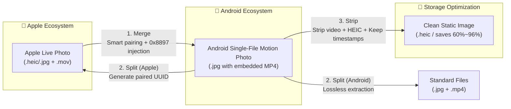

# LivePhotoConvert (Live & Motion Photo Toolkit)
<p align="center">
  
</p>

<p align="center">
  <strong>⚡ Bidirectional High-Fidelity Converter & Batch Optimizer between Apple Live Photos and Android Motion Photos</strong>
</p>

<p align="center">
  <a href="https://github.com/ZhiQiu-Kinsey/AppleLivePhotoConvert/releases/latest"></a>
  <a href="https://dotnet.microsoft.com/download"></a>
  
  
  <a href="https://github.com/ZhiQiu-Kinsey/AppleLivePhotoConvert/actions/workflows/ci.yml"></a>
  <a href="../LICENSE"></a>
</p>

<p align="center">
  <a href="../README.md"><b>简体中文</b></a> • <a href="README.en.md"><b>English</b></a>
</p>

---

## 🎯 Workflow Overview



---

## 🌟 Core Capability Matrix

| Module | Command / Menu | Input Format | Output | Key Benefit |
| :--- | :--- | :--- | :--- | :--- |
| **Live Photo Merge** | `merge`<br/>`1. Merge Live Photos` | `HEIC/JPG` + `MOV`<br/>(iPhone exported) | Android Motion Photo (`.jpg`) | Seamless playback in **Xiaomi Gallery (HyperOS / MIUI), Google Photos, Windows 11 Photos** |
| **Standard Split** | `split -f android`<br/>`2. Split Motion Photos` | Motion Photo (`.jpg/.heic`) | Cover + Video (`.jpg/.heic` + `.mp4`) | Lossless demuxing for universal video editing, backup, and playback |
| **Live Photo Reconstruct** | `split -f apple`<br/>`2. Split Motion Photos` | Motion Photo (`.jpg/.heic`) | Apple Live Photo (`.jpg/.heic` + `.mov`) | Generates paired `ContentIdentifier` UUIDs for **direct dynamic playback in iOS/macOS Photos** |
| **Space Optimizer** | `strip`<br/>`3. Space Optimization` | Motion Photo (`.jpg/.heic`) | Compact Image (`.heic` or clean `.jpg`) | **Strips embedded MP4 and encodes HEIC**, saving **60%~96%** space while **100% preserving timestamps & EXIF** |

---

## ⚡ Technical Highlights

- ⚡ **Lossless Stream Copying & Instant Conversion**:
  - Video stream copying (`-c:v copy`) avoids re-encoding, preserving 100% original video quality.
  - Automatically identifies iPhone front-facing mirror matrices and adapts rotation/mirroring.
- 🗜️ **Industrial-Grade HEIC Compression**:
  - Powered by `heif-enc` (`libheif / x265`) for superior quality-to-size ratios (default quality 65).
  - **Benchmark (100 Real Xiaomi Motion Photos)**: Size reduced from `603.46 MB` to `194.12 MB` (**409.34 MB saved, 67.8% compression ratio**).
  - **100% Timestamp Integrity**: Pre-captures and restores `CreationTime` and `LastWriteTime` without shifting photo timelines.
- 🚀 **Native AOT Ultra-Fast Startup**:
  - Compiled directly to native machine code via .NET 10 **Native AOT**. Starts in milliseconds with no runtime installation required.
- 📥 **Automated Tool Management**:
  - Automatically detects, downloads, and configures `ExifTool`, `FFmpeg`, and `heif-enc` via domestic accelerated mirrors and GitHub proxies.
- 🖥️ **Modern Dual Interaction**:
  - **Interactive Mode**: Guided Spectre.Console terminal UI with **native Windows PerMonitorV2 folder picker** and drag-and-drop.
  - **CLI Mode**: Full non-interactive parameter control with concurrency tuning for NAS and batch automation.

---

## 📸 Interface Preview

<p align="center">
  
</p>

---

## 🚀 Quick Start

### 1. Download
Download the latest `LivePhotoConvert` portable ZIP from the [Releases Page](https://github.com/ZhiQiu-Kinsey/AppleLivePhotoConvert/releases) and extract it.

### 2. Prepare Source Files
- **iPhone Live Photos**: In iPhone **Photos** app, select photos $\rightarrow$ tap **Share** $\rightarrow$ **Save to Files** or **Export Unmodified Originals**.
- **Android Motion Photos**: Photos exported directly from Xiaomi, OPPO, vivo, or Google Pixel phones containing embedded video.

### 3. Run Conversion
Double-click `LivePhotoConvert.exe`:
- **First Run**: Automatically checks tools and offers one-click download if missing.
- **Select Action**: Choose `1. Merge`, `2. Split`, or `3. Space Optimization` from the color menu.

---

## 💻 Command Line Interface (CLI)

```bash
# ==================== 1. Merge Mode ====================
# Merge iPhone photos and MOV videos into Android Motion Photos
LivePhotoConvert merge -i "D:\Photos" -o "D:\MotionPhotos"

# Merge and move matched source files quietly
LivePhotoConvert merge -i "D:\Photos" -o "D:\MotionPhotos" -s move -y

# ==================== 2. Split Mode ====================
# Split into standard Android format (.jpg + .mp4)
LivePhotoConvert split -i "D:\MotionPhotos" -o "D:\Output" -f android

# Split and reconstruct Apple Live Photos (.jpg + .mov with UUIDs)
LivePhotoConvert split -i "D:\MotionPhotos" -o "D:\AppleLivePhotos" -f apple

# ==================== 3. Optimization Mode (Strip) ====================
# In-place optimization: Strip embedded video + convert to HEIC (saves space, keeps timestamps)
LivePhotoConvert strip -i "D:\Photos"

# Output optimized images to a separate directory
LivePhotoConvert strip -i "D:\Photos" -o "D:\Optimized"

# Strip embedded video only (keep original JPEG format)
LivePhotoConvert strip -i "D:\Photos" --no-heic

# Custom HEIC compression quality (1-100, default 65)
LivePhotoConvert strip -i "D:\Photos" -q 75

# ==================== 4. Tool Management ====================
# Pre-download and verify all dependencies (ExifTool / FFmpeg / heif-enc)
LivePhotoConvert tools --auto-download
```

### CLI Options Reference

| Option | Alias | Applicable Command | Default | Description |
| :--- | :---: | :---: | :---: | :--- |
| `--input <dir>` | `-i` | All | *(Dialog)* | Input directory path (opens native folder picker when omitted) |
| `--output <dir>` | `-o` | All | *(In-place/Dialog)* | Output directory path (`strip` modifies in-place when omitted) |
| `--format <format>` | `-f` | `split` | `android` | Target format: `android` (standard Android) or `apple` (Apple Live Photo) |
| `--no-heic` | | `strip` | `false` | Skip HEIC conversion and only strip embedded videos |
| `--quality <num>` | `-q` | `strip` | `65` | HEIC compression quality (1–100, 65 balances near-lossless quality with high compression) |
| `--source-action <mode>`| `-s` | `merge` | `keep` | Post-merge source file action: `keep`, `move`, `recycle`, `delete` |
| `--no-verify` | | `merge` | `false` | Skip smart multi-signal validation and match solely by filename |
| `--parallel <count>` | `-p` | All | *(Auto)* | Number of parallel worker threads (tuned to CPU core count) |
| `--overwrite` | | All | `false` | Overwrite existing files in output directory instead of appending suffixes |
| `--auto-download` | | All | `false` | Automatically download missing external tools quietly via mirrors |
| `--mirror <prefix>` | | `tools` | *(Built-in)* | Custom GitHub/CDN mirror prefix (e.g. `https://ghfast.top/`) |
| `--exiftool <path>` | | All | *(Auto)* | Explicit path to `exiftool.exe` |
| `--ffmpeg <path>` | | All | *(Auto)* | Explicit path to `ffmpeg.exe` |
| `--heif-enc <path>` | | `strip` / All | *(Auto)* | Explicit path to `heif-enc.exe` |
| `--yes` | `-y` | All | `false` | Skip interactive confirmation prompts for automated scripts |

> [!NOTE]
> **Exit Codes**: `0` Success, `1` Runtime failure, `2` Invalid argument, `3` User cancelled, `4` Partial failure.

---

## 🔬 Technical Principles & Reverse Engineering

### 1. Android Motion Photo Binary Container
Android Motion Photos follow the [Google Motion Photo Specification](https://developer.android.com/media/platform/motion-photo-format), appending the MP4 video directly to the JPEG binary stream, with metadata injected into XMP:
* `GCamera:MicroVideo = 1`: Declares the existence of embedded video.
* `GCamera:MicroVideoOffset`: Byte length of embedded video from EOF.
* `GCamera:MicroVideoPresentationTimestampUs`: Presentation timestamp of the cover image in microseconds.

### 2. Xiaomi Gallery `0x8897` Tag Reverse Engineering
Standard Google XMP metadata alone fails to trigger dynamic playback in Xiaomi MIUI / HyperOS Gallery. Reverse engineering the official APK using `jadx-gui` revealed:

<p align="center">
  
</p>

Xiaomi Gallery inspects a proprietary Exif tag `34967` (hexadecimal **`0x8897`**). This toolkit automatically configures and writes this tag using ExifTool, achieving native dynamic playback on Xiaomi devices.

### 3. Apple Live Photo Pair Identifier
Apple Live Photos require a bidirectional UUID pair:
* **Image**: `ContentIdentifier` in MakerNotes / Exif.
* **Video**: `com.apple.quicktime.content.identifier` in QuickTime metadata with `still-image-time = 0`.
* The `apple` split mode generates paired UUIDs and writes bidirectional metadata for native iOS / macOS Photos playback.

### 4. Space Optimization & Timestamp Fidelity
* **Lossless Demuxing**: Reads `MicroVideoOffset` and truncates video bytes via zero-allocation stream copy, then clears motion photo tags;
* **Independent HEIC Encoding**: Encodes static images via `heif-enc` (`libheif / x265`), preserving full EXIF metadata (GPS, camera model, lens);
* **Timestamp Pre-capture**: Captures `CreationTime` and `LastWriteTime` prior to atomic replacement, restoring them after write.

---

## 🛠️ Project Structure & Local Build

```
src/
  LivePhotoConvert.Core/       # Pure core library: binary streaming, metadata codec, tool drivers
  LivePhotoConvert.Cli/        # Console app: Spectre.Console UI, CLI parsing, progress bars
tests/
  LivePhotoConvert.Core.Tests/ # Automated unit tests (demux, sniff, pairing, optimization, cleanup)
```

```bash
# 1. Build Solution
dotnet build LivePhotoConvert.slnx

# 2. Run Test Suite (90 Unit Tests)
dotnet test LivePhotoConvert.slnx

# 3. Publish Native AOT Executable
dotnet publish src/LivePhotoConvert.Cli/LivePhotoConvert.Cli.csproj /p:PublishProfile=win-x64-aot -o dist/aot
```

---

## 💖 Acknowledgments & Open Source Projects

* [ExifTool by Phil Harvey](https://exiftool.org/) - Universal metadata reading and writing engine
* [FFmpeg](https://ffmpeg.org/) - Multimedia audio/video processing framework
* [libheif](https://github.com/strukturag/libheif) & [x265](https://www.videolan.org/developers/x265.html) - High-performance HEIF / HEIC codec
* [Magick.NET / ImageMagick](https://github.com/dlemstra/Magick.NET) - Image processing library
* [Spectre.Console](https://github.com/spectreconsole/spectre.console) - Beautiful .NET terminal UI library
* [Google Motion Photo Specification](https://developer.android.com/media/platform/motion-photo-format) - Android Motion Photo standard

---

## 📄 License

This project is licensed under the [MIT License](LICENSE). Contributions, issues, and PRs are welcome!
