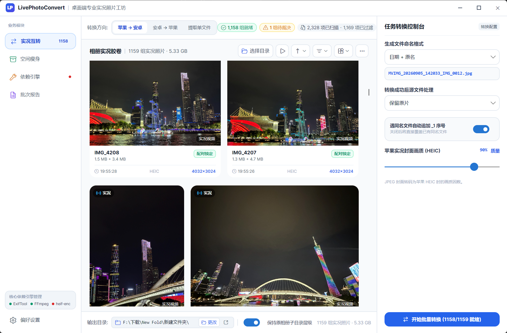
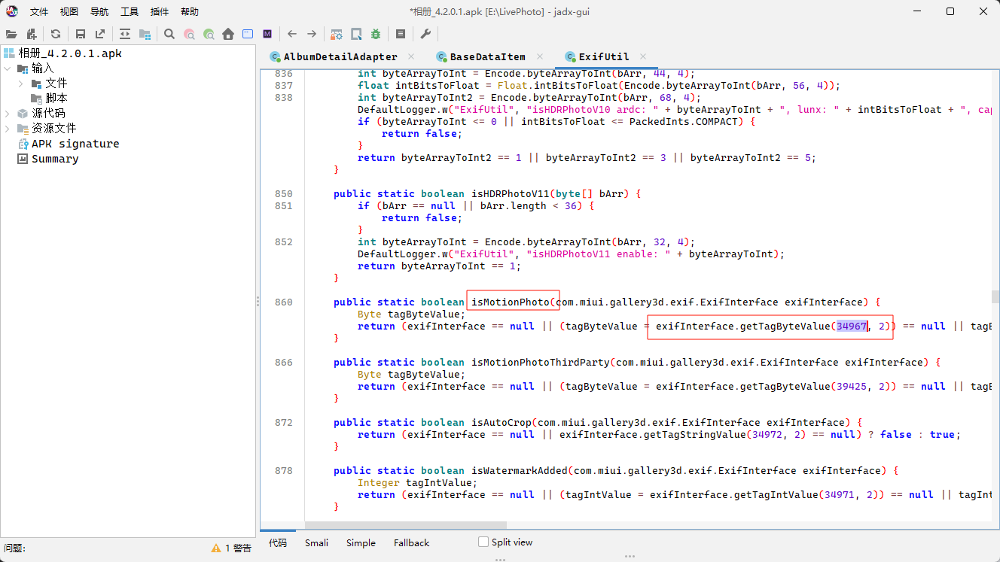

# LivePhotoConvert (Live & Motion Photo Toolkit)

<p align="center">
  
</p>

<p align="center">
  <strong>⚡ High-fidelity bidirectional converter between Apple Live Photos and Android Motion Photos</strong>
</p>

<p align="center">
  <a href="https://dotnet.microsoft.com/download"></a>
  <a href="https://github.com/ZhiQiu-Kinsey/AppleLivePhotoConvert/actions/workflows/ci.yml"></a>
  <a href="../LICENSE"></a>
  
  
</p>

<p align="center">
  <a href="../README.md"><b>简体中文</b></a> • <a href="README.en.md"><b>English</b></a>
</p>

---

## 🌟 Key Features

- 🔄 **Bidirectional Conversion & Restoration**:
  - **Merge Mode**: Combine iPhone-exported Live Photos (`HEIC/JPG` + `MOV`) into standard single-file Android Motion Photos (`.jpg`), perfectly playable across **Xiaomi Gallery (HyperOS / MIUI), Google Photos, and Windows 11 Photos**.
  - **Dual-Format Split Mode**:
    - **Standard Android Format (`android`)**: Losslessly unpack covers and embedded videos (`.jpg/.heic` + `.mp4`).
    - **Apple Live Photo Format (`apple`)**: Convert Android Motion Photos back into iOS-compatible Live Photos (`.jpg/.heic` + `.mov`) with paired `ContentIdentifier` UUIDs, allowing **direct import and dynamic playback in iOS / macOS Photos**.
- ⚡ **Lossless Stream Copying & High Efficiency**:
  - Video stream copying prioritizes lossless performance with instant processing speeds.
- 🚀 **Ultra-Compact Native AOT**:
  - Built with .NET 10 **Native AOT** pure machine code generation. Ready-to-run portable package with instant millisecond cold start.
- 📥 **One-Click Automated Tool Download**:
  - Built-in accelerated mirror downloads (including Aliyun CDN) automatically detect, download, and extract `ExifTool` and `FFmpeg` quietly on first run.
- 🖥️ **Modern Dual-Interaction Experience**:
  - **Interactive Mode**: Beautiful color terminal UI powered by Spectre.Console, featuring **native Windows folder browser dialogs** and drag-and-drop support.
  - **CLI Mode**: Comprehensive command-line arguments for automated scripting, concurrency management, and batch operations.
- 🧹 **Safe Cleanup & Integrity Verification**:
  - Optional post-merge strategies to keep, move, or delete matched source files. Strict length and metadata verification ensures unpaired long videos are never accidentally deleted.

---

## 📸 Interface Preview

<p align="center">
  
</p>

---

## 🚀 Quick Start

### 1. Download
Download the latest `LivePhotoConvert` portable ZIP archive from the [Releases Page](https://github.com/ZhiQiu-Kinsey/AppleLivePhotoConvert/releases) and extract it (includes the main executable and native acceleration libraries).

### 2. Export Photos from iPhone
1. Open the **Photos** app on your iPhone and select the Live Photos you wish to export.
2. Tap the **Share** button in the bottom-left corner $\rightarrow$ Choose **Export Unmodified Originals** and save them locally (each Live Photo exports as an image and a paired `.MOV` video).
3. Transfer the exported folder to your PC.

### 3. Run Conversion
Double-click `LivePhotoConvert.exe`:
* **First Run**: The program automatically checks for required external tools and offers a one-click automated download if missing.
* **Merging**: Choose `1. Merge Live Photos` in the menu, then select your input and output folders via the native folder picker.
* **Splitting**: Choose `2. Split Motion Photos` to extract as standard Android files or restore as Apple Live Photos.

---

## 💻 Command Line Interface (CLI)

In addition to interactive menus, full command-line arguments are supported for automation and scripting:

```bash
# 1. Basic merge: Combine photos and videos into Motion Photos
LivePhotoConvert merge -i "D:\Photos" -o "D:\MotionPhotos"

# 2. Merge and move processed source files quietly
LivePhotoConvert merge -i "D:\Photos" -o "D:\MotionPhotos" -s move -y

# 3. Split into standard Android format (.jpg + .mp4)
LivePhotoConvert split -i "D:\MotionPhotos" -o "D:\Output" -f android

# 4. Split into Apple Live Photo format (.jpg + .mov with UUID metadata)
LivePhotoConvert split -i "D:\MotionPhotos" -o "D:\AppleLivePhotos" -f apple

# 5. Pre-download or check external dependencies
LivePhotoConvert tools --auto-download
```

### CLI Options Reference

| Option | Alias | Applicable Command | Description |
| :--- | :--- | :--- | :--- |
| `--input <dir>` | `-i` | `merge` / `split` | Input directory path (opens native folder picker when omitted) |
| `--output <dir>` | `-o` | `merge` / `split` | Output directory path (opens native folder picker when omitted) |
| `--format <format>` | `-f` | `split` | Target format: `android` (standard Android, default) or `apple` (Apple Live Photo) |
| `--source-action <mode>`| `-s` | `merge` | Source file handling on success: `keep` (default), `move`, `recycle`, `delete` |
| `--strict` | | `merge` | Strict mode: Verify with Apple Content Identifier that files belong to the same Live Photo |
| `--parallel <count>` | `-p` | `merge` / `split` | Number of parallel processing workers (defaults to CPU core count) |
| `--overwrite` | | `merge` / `split` | Overwrite existing files in output directory instead of appending suffixes |
| `--auto-download` | | All | Automatically download missing ExifTool or FFmpeg dependencies via mirrors |
| `--mirror <prefix>` | | `tools` | Custom GitHub/CDN mirror prefix (e.g. `https://ghfast.top/`) |
| `--exiftool <path>` | | All | Explicit path to `exiftool.exe` |
| `--ffmpeg <path>` | | All | Explicit path to `ffmpeg.exe` |
| `--yes` | `-y` | All | Skip confirmation prompts for automated script execution |

> [!NOTE]
> **Exit Codes**: `0` All succeeded, `1` Runtime failure, `2` Invalid arguments, `3` User cancelled, `4` Partial failure.

---

## 🔬 Technical Principles & Reverse Engineering

### 1. Android Motion Photo Structure
Standard Android Motion Photos follow the [Google Motion Photo Specification](https://developer.android.com/media/platform/motion-photo-format?hl=en), concatenating a JPEG cover image with an MP4 video stream, annotated with XMP metadata:
* `GCamera:MicroVideo = 1`: Declares that the file contains an embedded video stream.
* `GCamera:MicroVideoOffset`: Byte offset of the video stream from the end of the file.
* `GCamera:MicroVideoPresentationTimestampUs`: Presentation timestamp of the representative still frame (in microseconds).

### 2. Reverse Engineering Xiaomi Gallery's `0x8897` Tag
During development, files containing only Google standard XMP tags failed to trigger live playback in Xiaomi Gallery. Using `jadx-gui` to decompile the official Xiaomi Gallery APK revealed the exact check logic:

<p align="center">
  
</p>

The decompiled code checks for a specific Exif tag:
* Decimal tag `34967` $\rightarrow$ Hexadecimal **`0x8897`**.
* Injecting this custom Exif tag via ExifTool ensures seamless live photo recognition across Xiaomi HyperOS and MIUI.

### 3. Apple Live Photo UUID Pairing Mechanism
Apple Live Photos require a matching UUID between the image and video:
* **Photo**: Injected as `ContentIdentifier` within MakerNotes / Exif metadata.
* **Video**: Injected into the QuickTime MOV container under `com.apple.quicktime.content.identifier` alongside `still-image-time = 0`.
* The `apple` split mode automatically assigns and writes paired UUIDs, ensuring imported files immediately support live playback on iOS and macOS.

---

## 🛠️ Project Architecture & Local Build

### Codebase Organization
```
src/
  LivePhotoConvert.Core/       # Pure core library: magic byte detection, binary concatenation, metadata encoding, process runner (0 3rd-party dependencies)
  LivePhotoConvert.Cli/        # Console application: Spectre.Console interactive UI, CLI parser, progress rendering
tests/
  LivePhotoConvert.Core.Tests/ # Comprehensive unit test suite (unpacking, sniffing, pairing, cleanup)
```

### Building from Source
Requires [.NET 10.0 SDK](https://dotnet.microsoft.com/download) and C# 13:

```bash
# 1. Restore and build solution
dotnet build LivePhotoConvert.slnx

# 2. Run test suite
dotnet test LivePhotoConvert.slnx

# 3. Publish Native AOT portable release package
dotnet publish src/LivePhotoConvert.Cli/LivePhotoConvert.Cli.csproj /p:PublishProfile=win-x64-aot -o dist/aot
```
> The output directory contains the main `LivePhotoConvert.exe` binary and the `Magick.Native-Q8-x64.dll` native acceleration library.

---

## 💖 Acknowledgments & Open Source Libraries

We would like to express our gratitude to the following open-source projects:

* [ExifTool by Phil Harvey](https://exiftool.org/) - Industry-standard multimedia metadata read/write engine
* [FFmpeg](https://ffmpeg.org/) - Leading cross-platform multimedia framework
* [Magick.NET / ImageMagick](https://github.com/dlemstra/Magick.NET) - Powerful image processing library
* [Spectre.Console](https://github.com/spectreconsole/spectre.console) - Feature-rich terminal UI library for .NET
* [Google Motion Photo Specification](https://developer.android.com/media/platform/motion-photo-format) - Android Motion Photo specification

---

## 📄 License

This project is open source under the [MIT License](../LICENSE). Contributions, issues, and pull requests are warmly welcomed!
