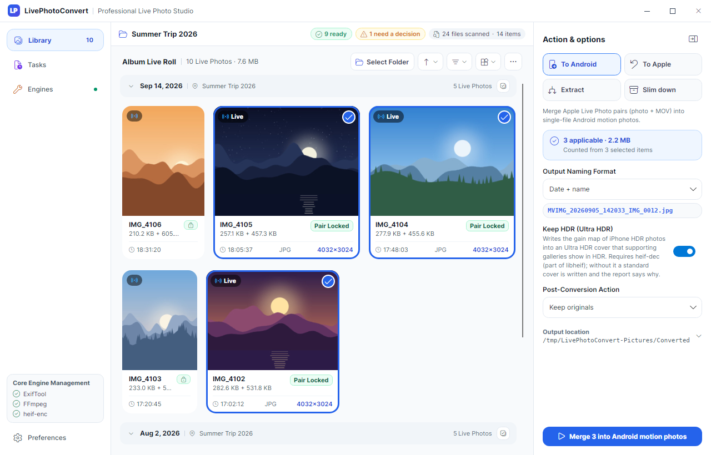
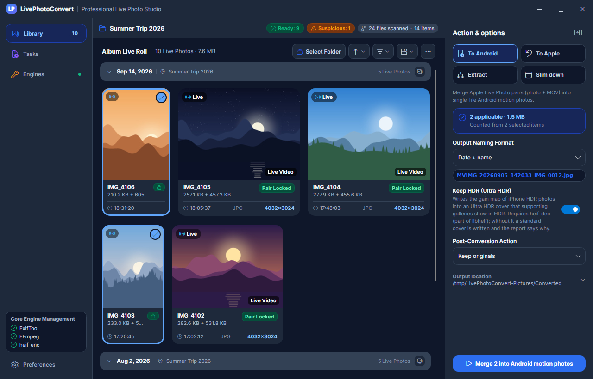
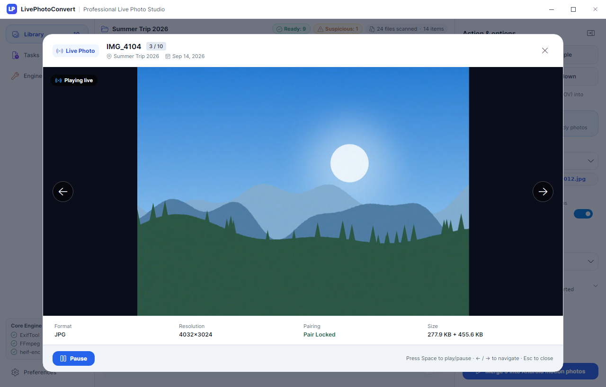
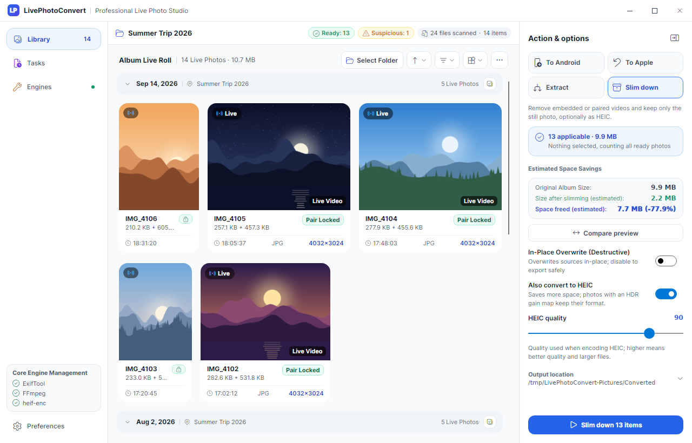
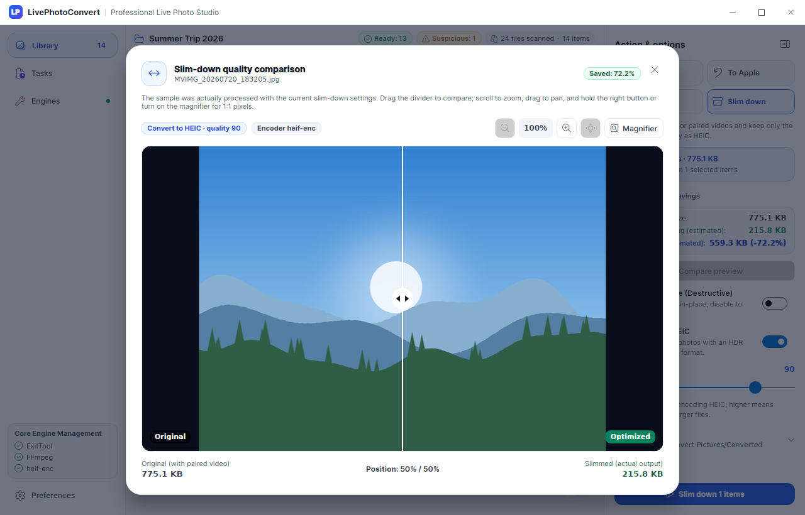
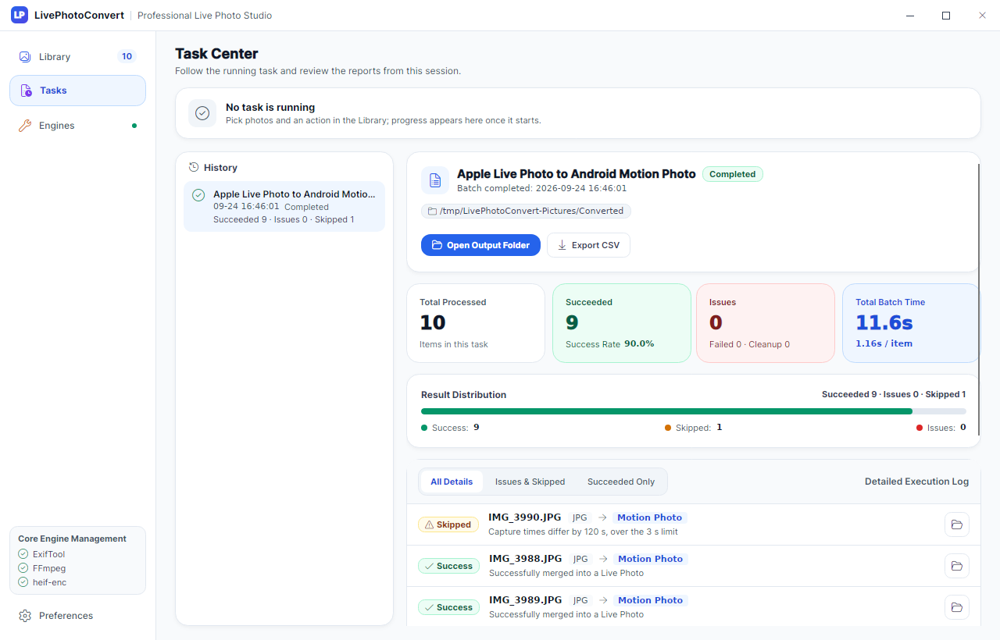
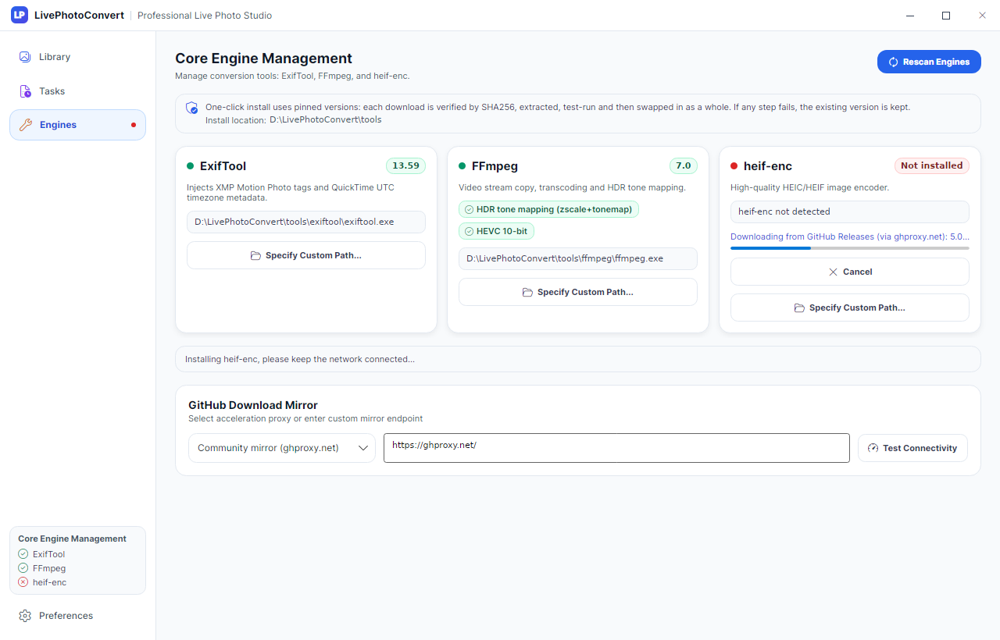
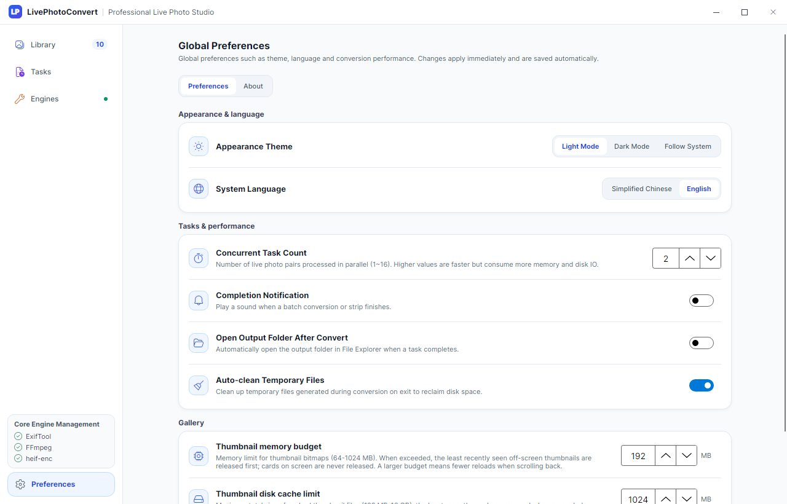

# LivePhotoConvert

<p align="center">
  
</p>

<p align="center">
  <strong>A Live Photo workbench: browse your album, convert between Apple Live Photos and Android motion photos, slim down the library, and keep HDR intact.</strong>
</p>

<p align="center">
  <a href="https://github.com/ZhiQiu-Kinsey/AppleLivePhotoConvert/releases"></a>
  
  <a href="https://dotnet.microsoft.com/download"></a>
  <a href="https://avaloniaui.net/"></a>
  <a href="https://github.com/ZhiQiu-Kinsey/AppleLivePhotoConvert/actions/workflows/ci.yml"></a>
  <a href="../LICENSE"></a>
</p>

<p align="center">
  <a href="../README.md">简体中文</a> · <b>English</b>
</p>

<p align="center">
  
</p>

## Contents

- [Features](#features)
- [Compared with other approaches](#compared-with-other-approaches)
- [Installation and updates](#installation-and-updates)
- [Getting started](#getting-started)
- [Keyboard shortcuts](#keyboard-shortcuts)
- [Safety and data protection](#safety-and-data-protection)
- [Formats and compatibility](#formats-and-compatibility)
- [Platform support](#platform-support)
- [FAQ](#faq)
- [Building from source](#building-from-source)
- [License and credits](#license-and-credits)
- [Support the project](#support-the-project)

## Features

### Four actions

Select photos in the library (or select nothing to act on every ready item), then pick an action and its options in the inspector on the right:

| Action | Input | Output |
| :--- | :--- | :--- |
| **To Android** | Apple Live Photo pairs (HEIC / JPG + MOV) | Single-file Android motion photos (`MVIMG_*.jpg`) that play on long-press in Google Photos, Xiaomi / HyperOS Gallery and others |
| **To Apple** | Android motion photos | Apple Live Photo pairs (`.HEIC` + `.MOV`) sharing one pairing identifier, recognized as Live Photos after importing into Photos on iPhone or Mac |
| **Extract** | Android motion photos | Cover image + standalone `.mp4`, cut byte-for-byte without re-encoding |
| **Slim down** | Android motion photos, Apple Live Photo pairs | Removes the embedded or paired video and keeps only the photo, optionally re-encoded as HEIC (quality 90 by default); export to a new folder or replace in place |

### Library and preview

- **One scan**: a single scan recognizes Apple Live Photo pairs, Android motion photos and plain photos; switching actions only filters. Questionable pairs (for example mismatched capture times) are flagged and wait for your decision.
- **Justified layout**: grouped by day, month or year, with several sort orders, small / medium / large sizes and square cropping. Thumbnails are generated per display scale and cached, correctly oriented and normalized to sRGB.
- **Live preview**: hover a card to play its Live Photo video; press Space for a full-window QuickLook and use the arrow keys to move between photos.
- **HDR**: iPhone HDR photos can stay HDR as Ultra HDR when converted to Android motion photos ("Keep HDR" in the inspector, on by default). HLG / PQ videos are tone-mapped for preview instead of looking washed out, and HDR video transcodes keep 10-bit and color metadata.
- **Slim-down comparison**: a sample is actually processed with your settings and shown in a curtain comparison with zoom and a 1:1 magnifier; the album-wide estimate is extrapolated from real compression ratios of sampled photos.

### Task center

Conversions run in the background and can be paused, resumed and canceled, with throughput and time remaining. Each finished task produces a report you can filter, reveal outputs or sources from, retry failed items from, and export as CSV. Reports are kept until the app closes.

### Engines

Conversions rely on three command-line tools: [ExifTool](https://exiftool.org/) (metadata), [FFmpeg](https://ffmpeg.org/) (video) and [heif-enc](https://github.com/strukturag/libheif) (HEIC encoding; heif-dec from the same package decodes HDR gain maps). The Engines page installs pinned versions with one click: each download is verified by SHA256, extracted and test-run before it replaces anything, and a failure leaves the existing version untouched. You can also point to executables you already have.

<details>
<summary><b>More screenshots</b></summary>

| | |
| :---: | :---: |
|  Library (dark) |  QuickLook live preview |
|  Slim down with space estimate |  Slim-down quality comparison |
|  Task report |  Engines |
|  Preferences | |

</details>

## Compared with other approaches

| | LivePhotoConvert | ExifTool / FFmpeg by hand | Phone makers' transfer or migration tools |
| :--- | :--- | :--- | :--- |
| Apple Live Photo → Android motion photo | Batch merge with Google Motion Photo XMP and the Exif tag Xiaomi Gallery needs | You concatenate files, compute the video offset and write the XMP yourself | Depends on vendor and OS version |
| Android motion photo → Apple Live Photo | Produces HEIC + MOV with the same ContentIdentifier on both sides | Requires building Apple MakerNotes and QuickTime Keys; ExifTool cannot create MakerNotes in a file that has none | Depends on vendor and OS version |
| Batch pairing and validation | Pairs by ContentIdentifier or file name, checks capture-time difference and video length, lets you review suspicious pairs | You write the scripts | Automatic, rules not documented |
| iPhone HDR photos | Can become Ultra HDR motion photos | Gain map conversion and both metadata sets are up to you | Depends on vendor and OS version |
| Original files | Staged then committed atomically, never overwrites sources of the same batch, source handling only after outputs are verified | Depends on your scripts | Usually copies without modifying originals |
| Browsing and preview | Gallery, hover playback, QuickLook, slim-down comparison | None | In the phone's gallery |
| Runs on | A Windows PC | Any system with the tools | The phone, no PC needed |

## Installation and updates

Download one of the following from [Releases](https://github.com/ZhiQiu-Kinsey/AppleLivePhotoConvert/releases). The app is compiled with Native AOT and needs no .NET runtime.

| File | Description |
| :--- | :--- |
| `LivePhotoConvert-v<version>-win-x64-Setup.exe` | **Recommended.** Installs for the current user into `%LocalAppData%\LivePhotoConvert.App` without admin rights, adds Start menu and desktop shortcuts, can be removed from Settings → Apps, and updates itself. |
| `LivePhotoConvert-v<version>-win-x64-Portable.zip` | Portable edition: unzip and run; also updates itself. |
| `LivePhotoConvert-v<version>-win-x64.zip` | Plain ZIP without automatic updates; download new versions manually. |

- **Automatic updates**: the app checks in the background about 10 seconds after launch, at most once a day; turn it off or check manually under Preferences → Updates. When a new version is available, a dialog shows the version, release notes and download size (delta updates supported), with Update now, Remind me later or Skip this version. After downloading, choose Restart and update or Install on next launch. If a task is running, update when it finishes or cancel it and update now.
- **Download source and verification**: the release list always comes straight from GitHub. Update packages may be downloaded through the GitHub mirror configured on the Engines page; the manifest and packages are verified by SHA256, so a mirror cannot change their contents.
- **Uninstall** removes only the program. Settings (`%AppData%\LivePhotoConvert`), logs, the thumbnail cache and dependencies (`%LocalAppData%\LivePhotoConvert`) are kept; delete them manually if you want.
- **Verifying downloads**: each release includes `SHA256SUMS.txt`; you can also verify build provenance with `gh attestation verify <file> -R ZhiQiu-Kinsey/AppleLivePhotoConvert`.
- The app is not code-signed yet, so Windows SmartScreen may warn about an unknown publisher on first run; choose Run anyway. Users of the 3.x ZIP need to install 4.0.0 once manually; later versions update automatically. Dependencies downloaded into the old ZIP folder are not moved to the installed edition; download them again on the Engines page.

## Getting started

1. **Install**: run the installer, or unzip the portable edition and run `LivePhotoConvert.exe` (see [Installation and updates](#installation-and-updates)).
2. **Install engines**: open the Engines page (Ctrl+3) and install whatever is missing. Tools needed per action:

   | Action | ExifTool | FFmpeg | heif-enc |
   | :--- | :---: | :---: | :---: |
   | To Android | Required | Required | heif-dec from it when keeping HDR |
   | To Apple | Required | Required | Required |
   | Extract | Required | — | — |
   | Slim down | Required | — | When converting to HEIC |
   | Hover playback / QuickLook | — | Required | — |

3. **Prepare photos**: export iPhone photos with "Unmodified Original" (Photos → Share → Options) so each Live Photo gives a photo and a `.MOV` with the same name; copy Android motion photos as they are.
4. **Open an album**: choose a folder in the library (Ctrl+O) or drag a folder into the window.
5. **Choose an action**: pick the action, output location and options in the inspector; select photos in the gallery first if you only want to process some of them.
6. **Start**: click the start button at the bottom of the inspector (or press Enter). Progress and reports are on the Tasks page.

## Keyboard shortcuts

| Scope | Keys | Action |
| :--- | :--- | :--- |
| Global | Ctrl+O | Choose an album folder (from any page; switches to the library first) |
| Global | F5 | Rescan the current album |
| Global | Enter | Start the inspector's current action (left to the focused text box or button when there is one) |
| Global | Ctrl+1 / 2 / 3 / 4 | Go to Library / Tasks / Engines / Preferences |
| Gallery | Ctrl+A | Select all |
| Gallery | Esc | Clear selection |
| Gallery | Space | QuickLook the most recently clicked or hovered photo |
| Gallery | Click / Ctrl+click / Shift+click | Select one / toggle / select a range |
| Gallery | Double-click | Open QuickLook |
| Dialogs | Esc | Close the dialog |
| QuickLook | Space | Play / pause |
| QuickLook | ← / → | Previous / next photo |

On macOS keyboards the Command key acts as Ctrl.

## Safety and data protection

- **Originals are never edited directly**: external tools only touch intermediate files the app creates. Intermediate files live in `LivePhotoConvert\temp-*` under the system temp folder, are removed on exit by default, and leftovers from a crash are removed at startup once they are older than 24 hours.
- **Atomic commit**: outputs are first written to staging files starting with `~lpc-` inside the target folder and renamed on the same volume only after verification; a failure or cancellation never leaves a half-written file.
- **Sources are never overwritten**: output names within a batch are assigned centrally, so neither "append index" nor "overwrite" can overwrite a source of the same batch or an output it already wrote. Paired outputs (HEIC + MOV) are committed or rolled back together; when overwriting existing files, they are backed up first and restored on failure.
- **In-place replacement**: slimming down in place needs a separate confirmation. A `.livephoto_backup` copy is kept during the replacement and deleted right after it succeeds; when the extension changes (JPG → HEIC) the new file is written first and the original removed afterwards, and the new file is undone if the removal fails.
- **When sources are handled**: "Move to backup", "Move to Recycle Bin" and "Delete permanently" run only after the outputs are committed and verified. Permanent deletion requires typing `DELETE`. Moved sources go to a subfolder of their own folder: `Merged` after merging and `Split` after splitting (`已合成` / `已拆分` when the interface is in Chinese; the name is fixed when the task starts).
- **Paired videos**: when slimming Apple Live Photo pairs in place, the paired MOV is moved to the Recycle Bin only if the pair passes validation, and is never deleted permanently; export mode leaves MOV files alone.
- **Disk space**: before starting, free space on the output drive is checked (1.2 × the source size plus 500 MB); if it is short you are warned and may continue anyway.
- **Timestamps and metadata**: outputs keep the source file timestamps, and EXIF, GPS and other metadata are carried over.

## Formats and compatibility

**Recognized input**

- Apple Live Photo pairs: a photo and a video with the same name in the same folder (photo `.heic` / `.jpg` / `.jpeg` / `.png`, video `.mov` / `.mp4`), or a photo and a video with the same ContentIdentifier (so files renamed by a cloud drive still pair). Among several candidates with the same name, HEIC > JPG > PNG and MOV > MP4.
- Pair validation: a matching ContentIdentifier passes immediately; otherwise the capture times must be within 3 seconds and the video no longer than 30 seconds. Pairs that fail are marked for review and are processed only after you confirm they belong together.
- Android motion photos: JPEGs with Google Motion Photo / MicroVideo XMP (including photos with an Ultra HDR gain map), Samsung motion photos, and HEICs with an embedded `mpvd` video. Ultra HDR photos with a gain map but no video are treated as plain photos.

**Output**

| Action | Files | Notes |
| :--- | :--- | :--- |
| To Android | `MVIMG_<name>.jpg`, `MVIMG_<date_time>_<name>.jpg` or `MVIMG_<date_time>.jpg` | JPEG cover followed by an MP4; writes Google Motion Photo XMP (`GCamera:MotionPhoto*`, `MicroVideo*` and `Container:Directory`) and the Exif tag `0x8897` Xiaomi Gallery uses to detect motion photos; the cover frame timestamp comes from the MOV's still-image timing track; non-MP4 videos are remuxed to MP4 and mirrored front-camera videos are re-encoded to fix orientation |
| To Apple | `<name>.HEIC` + `<name>.MOV` | JPEG covers are converted to HEIC; the photo's Apple MakerNotes and the video's QuickTime Keys get the same ContentIdentifier, with capture time, device model and location synchronized |
| Extract | `<name>.jpg` / `.heic` + `<name>.mp4` | Cut byte-for-byte, no re-encoding |
| Slim down | Original format or `.heic` | If the HEIC is not smaller than the original, the original format is kept and only the video is removed; photos with a gain map keep their format to preserve HDR |

**HDR**

- **iPhone HDR → Ultra HDR**: when merging, the Apple HDR gain map in the HEIC is converted to Ultra HDR (both ISO 21496-1 and Google `hdrgm` metadata) and written into the cover, so supporting Android galleries show it in HDR. If the source has no Apple gain map, only has an ISO `tmap` gain map (which iOS 18 and later may write), or heif-dec is missing, a standard cover is written and the report says why.
- **To Apple does not keep the gain map**: restored HEICs are standard dynamic range.
- **Video**: HDR videos that need transcoding use libx265 10-bit and keep the color triplet and HDR10 metadata; HEVC output is tagged `hvc1` so iOS plays it.

## Platform support

| Platform | Status |
| :--- | :--- |
| Windows 10 / 11 x64 | Supported, with release packages |
| Linux x64 | Runs from source; no release package. Install ExifTool, FFmpeg and libheif (heif-enc / heif-dec) with your package manager — the Engines page does not download them. There is no Recycle Bin: "Move to Recycle Bin" fails and is reported, and in-place slimming keeps paired MOV files |
| macOS | Not adapted: the referenced Magick.NET x64 package does not cover Apple Silicon, packages are not signed or notarized, and nothing has been verified on real hardware |
| Android / iOS | Not supported: conversions depend on launching command-line tools such as ExifTool and FFmpeg as local processes |

## FAQ

<details>
<summary><b>Engine downloads fail</b></summary>

ExifTool and FFmpeg are downloaded from the npmmirror mirror first; heif-enc and some fallback sources come from GitHub Releases through the download mirror set on the Engines page (`ghproxy.net` by default; other presets or a custom URL are available). Use "Test Connectivity" to check it. Whatever mirror is used, files are verified against the SHA256 in the manifest and rejected on mismatch.

If downloads still fail, download the tool yourself and use "Specify Custom Path" on its card, or put the executable in `tools\<tool>\` next to the app (for example `tools\ffmpeg\ffmpeg.exe`) or on `PATH`, then click "Rescan Engines".
</details>

<details>
<summary><b>HDR video preview looks washed out or reports it cannot be shown</b></summary>

HLG / PQ videos need FFmpeg's zscale and tonemap filters for tone mapping. Both FFmpeg builds the Engines page installs include them. If you point to your own FFmpeg, the Engines page shows whether "HDR tone mapping" is available; QuickLook reports the missing capability and links to the Engines page. The preview is tone-mapped to SDR, not shown in HDR.
</details>

<details>
<summary><b>Why are some photos still JPG after slimming down to HEIC?</b></summary>

When the HEIC is not smaller than the original (for example very noisy or already heavily compressed JPEGs), the original format is kept and only the video is removed; the report marks the item "Kept original format (HEIC was larger)". Photos with an Ultra HDR gain map also keep their format so HDR is not lost.
</details>

<details>
<summary><b>What does "Timestamp Mismatch" on a card mean?</b></summary>

When a photo and its same-named video were captured more than 3 seconds apart, the video is longer than 30 seconds, or only one side has a capture time, the app cannot confirm they are one Live Photo and leaves them out. Click the badge on the card to open the review dialog and compare the photo with the video's first frame: confirm to include the pair, or keep them apart.
</details>

<details>
<summary><b>Merged photos do not move on my Android phone</b></summary>

Transfer them with a cable, local network transfer or a cloud drive's original-quality upload; chat apps usually recompress images and drop the trailing video. If the gallery still shows a plain photo, wait for the system media scanner to pick up the file again.
</details>

<details>
<summary><b>Restored Live Photos are not Live Photos on my iPhone</b></summary>

The `.HEIC` and `.MOV` with the same name must be imported into the Photos library together (for example importing both files in Photos on a Mac); Photos matches them by their shared ContentIdentifier. Importing only one file, or passing them through a service that rewrites files, breaks the pairing.
</details>

<details>
<summary><b>Large albums use a lot of memory, or the cache takes disk space</b></summary>

Under Preferences → Gallery, set the thumbnail memory budget (64–1024 MB, 192 MB by default) and the disk cache limit (128 MB–16 GB, 1 GB by default), check usage and clear the cache. Cards on screen are not limited by the budget; after clearing, thumbnails are regenerated as needed.
</details>

<details>
<summary><b>Where are settings, logs and caches stored?</b></summary>

| Content | Location (Windows) |
| :--- | :--- |
| Settings | `%AppData%\LivePhotoConvert\settings.json` (renamed to `settings.json.corrupt` and replaced by defaults if unreadable) |
| Error logs | `%LocalAppData%\LivePhotoConvert\logs\` |
| Thumbnail cache | `%LocalAppData%\LivePhotoConvert\cache\thumbnails\` |
| Engines installed by the app | `tools\` next to the app; `%LocalAppData%\LivePhotoConvert\tools\` if that folder is not writable |
| Temporary files | `%TEMP%\LivePhotoConvert\` |
</details>

<details>
<summary><b>Windows says "Windows protected your PC"</b></summary>

Release packages are not code-signed, so SmartScreen may warn on first launch; choose "More info" → "Run anyway". You can check the download against `SHA256SUMS.txt` in the release, or verify its build provenance with `gh attestation verify <zip> -R ZhiQiu-Kinsey/AppleLivePhotoConvert`.
</details>

## Building from source

Requires the [.NET 10 SDK](https://dotnet.microsoft.com/download) (version pinned by `global.json`).

```bash
dotnet build LivePhotoConvert.slnx          # build
dotnet test LivePhotoConvert.slnx           # all tests; integration tests skip when external tools are missing
dotnet run --project src/LivePhotoConvert.Desktop/LivePhotoConvert.Desktop.csproj

# Windows x64 Native AOT publish
dotnet publish src/LivePhotoConvert.Desktop/LivePhotoConvert.Desktop.csproj -r win-x64 -c Release -o dist/aot
```

See [AGENTS.md](../AGENTS.md) for code layout and conventions, [docs/design](design/README.md) for subsystem design notes, and [CHANGELOG.md](../CHANGELOG.md) for release history (all in Chinese).

The screenshots in this README are produced by a UI test (FFmpeg required; with heif-enc the slim-down estimate uses real encoding):

```bash
LPC_DOCS_SCREENSHOTS=docs/screenshots dotnet test tests/LivePhotoConvert.Desktop.Tests --filter "FullyQualifiedName~ReadmeScreenshotTests"
```

## License and credits

LivePhotoConvert is released under the [MIT License](../LICENSE).

It runs or embeds the following projects — thanks to their authors (the same list as Preferences → About in the app):

- [ExifTool](https://exiftool.org/): metadata reading and writing
- [FFmpeg](https://ffmpeg.org/): video muxing, transcoding and playback decoding
- [libheif](https://github.com/strukturag/libheif) / [x265](https://www.videolan.org/developers/x265.html): HEIC encoding and decoding (heif-enc, heif-dec)
- [Magick.NET](https://github.com/dlemstra/Magick.NET): image decoding and thumbnails

Frameworks and specifications used to build it:

- [.NET](https://dotnet.microsoft.com/): runtime and Native AOT toolchain
- [Avalonia UI](https://avaloniaui.net/): cross-platform desktop UI framework
- [CommunityToolkit.Mvvm](https://github.com/CommunityToolkit/dotnet): MVVM source generators
- [FluentIcons.Avalonia](https://github.com/davidxuang/FluentIcons): Fluent icons
- [Velopack](https://velopack.io/): installer and automatic updates
- [Google Motion Photo format](https://developer.android.com/media/platform/motion-photo-format)

External tools are distributed under their own licenses; one-click installs download them from their official or mirror sources, and they are not bundled with this app.

## Support the project

If this tool helps you, you are welcome to buy the author a coffee.

<p align="center">
  
</p>

<p align="center">
  <sub>Scan with WeChat</sub>
</p>

Stars, [issues](https://github.com/ZhiQiu-Kinsey/AppleLivePhotoConvert/issues) and [pull requests](https://github.com/ZhiQiu-Kinsey/AppleLivePhotoConvert/pulls) are welcome too.
