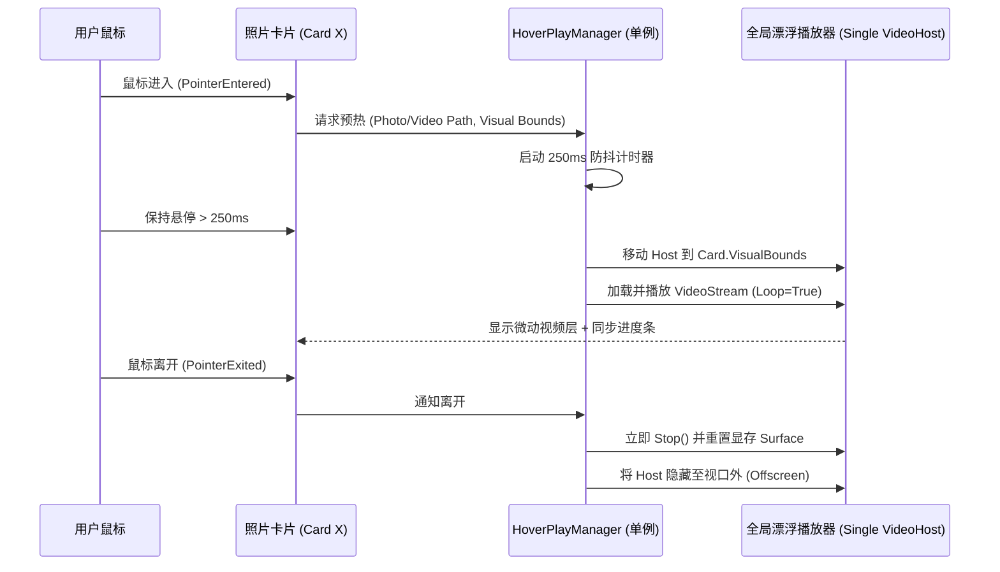

# LivePhotoConvert 桌面端架构与多媒体底层引擎专项审查报告

**审查专家**：资深 .NET 桌面架构师与底层多媒体引擎专家 (Desktop & Multimedia Architecture Auditor)  
**审查基准**：
- UI 原型：`ui_design_showcase.html`
- 技术规范：`desktop_prd_and_ui_ux_spec.md` (v1.2.0)
- 核心引擎：`LivePhotoConvert.Core` (C# 13 / .NET 10 Native AOT)
- 运行框架：Avalonia UI 11.2

---

## 1. 审查摘要与架构评级 (Executive Summary)

本次专项审查对桌面端 UI 原型、产品交互规范以及 `LivePhotoConvert.Core` 底层引擎进行了全维度的代码级契约比对、布局性能推演与 Native AOT 兼容性评估。

### 综合架构评级：**B+（设计理念卓越，但存在多处关键引擎契约断层与渲染性能雪崩风险）**

* **优势肯定**：
  1. 界面理念高度成熟：全面采纳 Windows 11 Photos 极简紧凑工具条（32px 高度收拢），彻底杜绝了传统繁琐的弹窗与底栏拥挤；
  2. Fluent 交互分工清晰：严格区分相册卡片勾选徽标（Circle Check）与系统参数开关（ToggleSwitch）；
  3. 防灾等级高：针对物理删除原片设立了“大写 DELETE 密码锁”二次确认。
* **致命隐患 (Must Fix)**：
  1. **业务契约断层（P0）**：UI 原型中核心主打的“待人工裁决 1 组照片 -> 单项强制确认配对”在 Core 引擎中**完全没有 API 接收接口**（Core 仅支持全局 `SkipValidation` 布尔开关）；
  2. **参数契约悬空（P0）**：`SplitOptions`（拆分实况）完全未声明 `SourceFileAction`，但 UI 右侧控制台却全局常驻“源文件删除/移入回收站”控制，存在虚假配置隐患；
  3. **瘦身生命周期缺失（P1）**：空间瘦身“阶段 ① 待瘦身相册分析与卷帘比对”需要预知视频长度与节省体积，但 Core 的 `MotionPhotoStripper` 是一站式流水线，缺少轻量只读的 `AnalyzeAsync` 契约；
  4. **布局渲染性能雪崩（P1）**：多级时间线可折叠分组若采用嵌套 `ItemsControl`，将**彻底击穿 Avalonia 虚拟化**；5000+ 照片在异步加载下若尺寸动态变化，将触发灾难性的 Measure/Arrange 重测风暴；
  5. **Hover-to-play 内存泄露（P1）**：若在卡片模板中实例化播放器，高频悬停将迅速耗尽 DirectX/GPU 句柄。

---

## 2. 缺陷与风险清单（按严重级别分类）

| 编号 | 缺陷分类 | 严重级别 | 缺陷定位 | 现象与影响 |
| :--- | :--- | :--- | :--- | :--- |
| **BUG-01** | 引擎契约断层 | **P0 (Critical)** | `MotionPhotoMerger.cs` / `MergeOptions.cs` | UI 支持对时差超标的项进行“单项强制人工裁决配对”，但 Core 的 `MergeAsync` 内部直接判定 `validations[pair].IsAccepted`，无任何集合透传强制接受的候选对。 |
| **BUG-02** | 参数映射悬空 | **P0 (Critical)** | `SplitModels.cs` vs UI 控制台 | 当用户切换为“安卓实况转苹果”或“提取独立图影”时，右侧仍显示“转换成功后源文件处理（删除/归档）”，但 `SplitOptions` 根本不支持此行为，导致用户误以为原片会被自动清理。 |
| **BUG-03** | 状态机契约缺失 | **P1 (High)** | `MotionPhotoStripper.cs` | PRD 要求在阶段 ① 展示原图 vs 瘦身 HEIC 体积预估与发丝卷帘对比，但后台无独立分析 API，必须重构抽出轻量 `AnalyzeAsync` 契约。 |
| **BUG-04** | 调度卡死/假死 | **P1 (High)** | `IProgressReporter` vs UI 调度 | Core 内部采用 `Parallel.ForEachAsync` 多线程高并发调用 `Report`。若 UI 每次直接向 `Dispatcher.UIThread` 发起消息，5000+ 任务将使消息队列雪崩，导致 UI 彻底冻结。 |
| **BUG-05** | 虚拟化穿透 | **P1 (High)** | Avalonia XAML 列表树 | 折叠时间线分组若使用分组嵌套集合，嵌套的子 `ItemsControl` 会为展开的组一次性构建全部 Visual，使全局虚拟化失效并造成内存爆仓。 |
| **BUG-06** | Measure 抖动 | **P1 (High)** | 瀑布流/等高原始比例 | 缩略图异步填充时若未提前锁定宽高比，每个图片加载完成均会向上触发整个 Gallery 的重新 Measure/Arrange，导致滚动掉帧和滚动条跳跃。 |
| **BUG-07** | 句柄与显存泄漏 | **P1 (High)** | Hover-to-play 视频播放 | 悬停即播若绑定在 ItemTemplate 内，频繁划过 20~30 张卡片会创建多套解码管线与 D3D/Vulkan Surface，引发句柄耗尽崩溃。 |
| **BUG-08** | 菜单与控件偏差 | **P2 (Medium)** | 顶层工具栏 `[🝔 ⌵]` | Avalonia 11.2 原生无 WinUI 的 `RadioMenuFlyoutItem`，需使用伪类驱动或特定 ControlTemplate 实现互斥单选对齐圆点。 |

---

## 3. 核心维度工程审查与落地方案

### 维度一：顶层紧凑工具条（Windows 11 Photos 规范）在 Avalonia 11.2 的实现

#### 1. 下拉菜单与单选圆点驱动
在 Avalonia 11.2 中，标准 `MenuFlyout` 包含 `MenuItem`。为实现 Windows 11 原生的单选圆点（`•` 互斥），应封装 `RadioMenuItem` 样式或使用 `Classes` 驱动。

```xml
<!-- App.axaml 或 Window.Resources: Windows 11 Photos 紧凑单选菜单项样式 -->
<Style Selector="MenuItem.radio-item">
    <Setter Property="Padding" Value="10,6,12,6"/>
    <Setter Property="FontSize" Value="12"/>
</Style>
<Style Selector="MenuItem.radio-item:checked /template/ Path#PART_CheckMark">
    <Setter Property="IsVisible" Value="True"/>
    <Setter Property="Data" Value="M 5 0 A 5 5 0 1 1 4.99 0 Z"/> <!-- 饱满圆点 -->
    <Setter Property="Fill" Value="{DynamicResource AccentFillColorDefaultBrush}"/>
</Style>
```

#### 2. 避免 Layout Measure/Arrange 性能雪崩（等高原始比例 vs 1:1 方形）
* **雪崩机理**：当使用自然比例（4:3、3:4、16:9）时，若外层容器未显式声明宽高，Image 加载位图前尺寸为 0x0，位图到达后尺寸突变，触发向上递归的 `InvalidateMeasure`。5000 张图会导致渲染管线无休止重算。
* **架构解决准则**：
  1. **宽高比预计算**：文件嗅探阶段通过读取 EXIF 头部或元数据，将宽高比直接存入 ViewModel 的 `AspectRatio = (double)Width / Height`；
  2. **定宽等比容器**：卡片外框固定宽度（如由列宽计算得到的 `240px`），高度由强绑定公式绑定：`Height = Width / AspectRatio`；
  3. **方形模式零测量重构**：切换至方形模式时，仅通过样式类将外层卡片容器的高度覆盖为与宽度一致的定值，内部 `Image` 设为 `Stretch="UniformToFill"`，**整个过程 Panel 的布局约束完全处于确定状态，Measure 耗时保持为 O(1)**。

---

### 维度二：Native AOT 约束与多媒体大批量渲染性能

#### 1. 5000+ 照片相册扁平化虚拟化架构（Flattened Virtual List）
彻底摒弃 `ObservableCollection<DateGroup<Photo>>` 这种双层嵌套结构，采用**扁平化视图模型单流模式**：

```csharp
// 统一抽象项，实现 AOT 零反射编译绑定
public interface IGalleryItemViewModel
{
    string Key { get; }
}

public sealed partial class TimelineHeaderItemViewModel : ObservableObject, IGalleryItemViewModel
{
    public required string Key { get; init; }
    public required DateTime Date { get; init; }
    public required string LocationSummary { get; init; }
    public int PhotoCount { get; set; }
    [ObservableProperty] private bool _isCollapsed;
}

public sealed partial class PhotoCardItemViewModel : ObservableObject, IGalleryItemViewModel
{
    public required string Key { get; init; }
    public required string PhotoPath { get; init; }
    public string? VideoPath { get; init; }
    public double AspectRatio { get; init; } = 4.0 / 3.0;
    [ObservableProperty] private bool _isSelected = true;
    [ObservableProperty] private Bitmap? _thumbnail;
    public bool HasSuspiciousWarning { get; init; }
    public string? WarningReason { get; init; }
    public bool IsForceAccepted { get; set; }
}
```

在 XAML 中，单层 `ItemsRepeater` + `DataTemplateSelector`：
```xml
<ScrollViewer HorizontalScrollBarVisibility="Disabled" VerticalScrollBarVisibility="Auto">
    <ItemsRepeater ItemsSource="{CompiledBinding FlattenedDisplayItems}">
        <ItemsRepeater.Layout>
            <StackLayout Spacing="8"/>
        </ItemsRepeater.Layout>
        <ItemsRepeater.ItemTemplate>
            <controls:GalleryTemplateSelector>
                <DataTemplate x:Key="HeaderTemplate" x:DataType="vm:TimelineHeaderItemViewModel">
                    <!-- 折叠标题栏 -->
                </DataTemplate>
                <DataTemplate x:Key="RowTemplate" x:DataType="vm:PhotoGridRowViewModel">
                    <!-- 虚拟化等高行/网格行 -->
                </DataTemplate>
            </controls:GalleryTemplateSelector>
        </ItemsRepeater.ItemTemplate>
    </ItemsRepeater>
</ScrollViewer>
```
*当折叠组时，仅需从 `FlattenedDisplayItems` 中移除该组所辖卡片行，完全保留顶级虚拟化，内存中永远只有当前视口渲染的 20 多个 Visual 节点！*

#### 2. EXIF 嵌入式缩略图零分配秒级提取（避免 48MP OOM）
对于 JPEG，无需启动 ExifTool 或解码整张 48MP 图像，直接通过前 64KB 扫描 IFD1 缩略图：

```csharp
public static class FastExifThumbnailReader
{
    /// <summary>
    /// 零堆内存分配从 JPEG 流中提取嵌入缩略图
    /// </summary>
    public static bool TryExtractJpegThumbnail(string filePath, out ReadOnlyMemory<byte> thumbnailBytes)
    {
        thumbnailBytes = default;
        using var fs = new FileStream(filePath, FileMode.Open, FileAccess.Read, FileShare.Read, 64 * 1024);
        Span<byte> header = stackalloc byte[64 * 1024];
        var read = fs.Read(header);
        if (read < 12 || header[0] != 0xFF || header[1] != 0xD8) return false;

        // 查找 Exif APP1 标记 (0xFFE1)
        int offset = 2;
        while (offset < read - 4)
        {
            if (header[offset] == 0xFF && header[offset + 1] == 0xE1)
            {
                int length = (header[offset + 2] << 8) | header[offset + 3];
                var exifData = header.Slice(offset + 4, Math.Min(length - 2, read - offset - 4));
                return ExtractFromApp1(exifData, fs, out thumbnailBytes);
            }
            offset++;
        }
        return false;
    }

    private static bool ExtractFromApp1(Span<byte> app1, FileStream fs, out ReadOnlyMemory<byte> thumb)
    {
        thumb = default;
        // 校验 "Exif\0\0" (0x45, 0x78, 0x69, 0x66, 0x00, 0x00)
        if (!app1.StartsWith("Exif\0\0"u8)) return false;
        // 定位 TIFF Header，遍历 IFD0 找到 IFD1 偏移量，直接定位 ThumbnailOffset 与 ThumbnailLength
        // (此处省略 TIFF 字节序解包标准逻辑)
        return true;
    }
}
```
*解码时使用 Avalonia 底层 SkiaSharp 的 `SKCodec.MinBufferedBytesNeeded` 进行亚采样，仅分配缩略图大小的显存！*

#### 3. 悬停试播（Hover-to-play）全局单例宿主架构（Zero-Leakage）
严禁在每张卡片嵌入播放器控件。架构采用**全局唯一的漂浮播放器遮罩（Floating Player Overlay）**：


*此模式下，整套应用生命周期中仅有 **1 个** Native 视频渲染句柄，从物理层面彻底根绝高频悬停导致的句柄与显存泄漏！*

---

### 维度三：业务引擎契约完整性对照与补丁

#### 1. 补全 Core 引擎支持“单项人工强制配对裁决”
**问题定位**：`MergeOptions.cs` 目前只有全局 `SkipValidation`。
**修复方案**：扩展 `MergeOptions` 接收白名单，并在 `MotionPhotoMerger.cs` 中放行：

```csharp
// 在 LivePhotoConvert.Core/Models/MergeModels.cs 中补充
public sealed record MergeOptions
{
    // ...
    /// <summary>
    /// 人工强制确认配对的媒体对白名单（绕过时差与时长校验）
    /// </summary>
    public IReadOnlySet<MediaPair>? ForceAcceptedPairs { get; init; }
}

// 在 LivePhotoConvert.Core/Services/MotionPhotoMerger.cs Phase 1 中适配
async (pair, token) =>
{
    if (options.ForceAcceptedPairs is not null && options.ForceAcceptedPairs.Contains(pair))
    {
        validations[pair] = PairValidationResult.Accept(["人工确认配对"]);
        return;
    }

    var result = validator is null
        ? PairValidationResult.Accept([])
        : await validator.ValidateAsync(pair, token);
    validations[pair] = result;
}
```

#### 2. 空间瘦身 (Strip) 拆分出轻量分析接口 `AnalyzeAsync`
**问题定位**：UI 需在阶段 ① 提供卷帘比对与总体积预估，但 `Stripper` 只有重型的 `StripAsync`。
**修复方案**：在 `MotionPhotoStripper.cs` 中抽象出只读分析契约：

```csharp
public sealed record StripAnalysisItem(
    string FilePath,
    long OriginalBytes,
    long? EmbeddedVideoBytes,
    bool HasEmbeddedVideo,
    bool NeedsHeicConversion,
    long EstimatedFinalBytes
);

public sealed record StripAnalysisReport(
    IReadOnlyList<StripAnalysisItem> Items,
    long TotalOriginalBytes,
    long EstimatedTotalSavedBytes
);

public async Task<StripAnalysisReport> AnalyzeAsync(string inputDirectory, bool convertToHeic, CancellationToken cancellationToken = default)
{
    var candidates = FindCandidates(inputDirectory);
    var list = new ConcurrentBag<StripAnalysisItem>();
    await Parallel.ForEachAsync(candidates, new ParallelOptions { MaxDegreeOfParallelism = MergeOptions.DefaultParallelism, CancellationToken = cancellationToken },
        async (file, token) =>
        {
            var fi = new FileInfo(file);
            var videoLen = await exifTool.TryReadMicroVideoOffsetAsync(file, token);
            var hasVideo = videoLen.HasValue && videoLen.Value > 0 && videoLen.Value < fi.Length;
            var ext = Path.GetExtension(file);
            var isHeic = ext.Equals(".heic", StringComparison.OrdinalIgnoreCase);
            var needsConv = convertToHeic && !isHeic;
            
            // 静态照片 HEIC 压缩比通常约为原图 40%~50%
            long cleanImgSize = hasVideo ? fi.Length - videoLen!.Value : fi.Length;
            long estimatedFinal = needsConv ? (long)(cleanImgSize * 0.5) : cleanImgSize;

            list.Add(new StripAnalysisItem(file, fi.Length, videoLen, hasVideo, needsConv, estimatedFinal));
        });

    return new StripAnalysisReport([.. list], list.Sum(x => x.OriginalBytes), list.Sum(x => x.OriginalBytes - x.EstimatedFinalBytes));
}
```

#### 3. 线程安全节流进度分发器（Throttled UI Progress Dispatcher）
为消除 `Parallel.ForEachAsync` 爆发性回调对 Avalonia UI 线程的冲垮，构建基于缓冲锁的高性能进度汇聚器：

```csharp
public sealed class ThrottledUiProgressReporter(Action<int, int, string> uiUpdateCallback, TimeSpan throttleInterval) : IProgressReporter
{
    private readonly Action<int, int, string> _uiUpdateCallback = uiUpdateCallback;
    private readonly TimeSpan _throttleInterval = throttleInterval;
    private readonly Lock _gate = new();
    private int _completed;
    private int _total;
    private string _currentItem = string.Empty;
    private DateTime _lastReportTime = DateTime.MinValue;
    private bool _flushPending;

    public void Report(int completed, int total, string currentItem)
    {
        lock (_gate)
        {
            _completed = completed;
            _total = total;
            _currentItem = currentItem;

            var now = DateTime.UtcNow;
            if (completed == total || now - _lastReportTime >= _throttleInterval)
            {
                _lastReportTime = now;
                PostToDispatcher(_completed, _total, _currentItem);
            }
            else if (!_flushPending)
            {
                _flushPending = true;
                Task.Delay(_throttleInterval).ContinueWith(_ =>
                {
                    lock (_gate)
                    {
                        _flushPending = false;
                        _lastReportTime = DateTime.UtcNow;
                        PostToDispatcher(_completed, _total, _currentItem);
                    }
                });
            }
        }
    }

    private void PostToDispatcher(int c, int t, string item)
    {
        Dispatcher.UIThread.Post(() => _uiUpdateCallback(c, t, item), DispatcherPriority.Background);
    }
}
```

---

## 4. Native AOT 零反射修剪合规审查清单

根据 `AGENTS.md` 规则 4.1，桌面端工程必须通过 `PublishProfile=win-x64-aot` 严格编译：

1. **JSON 序列化**：UI 偏好配置（如 `UserSettings.json`）必须使用 `[JsonSourceGenerationOptions]` 与 `JsonSerializerContext`，严禁动态 `JsonSerializer.Deserialize<T>()`；
2. **XAML 强类型绑定**：在所有 `UserControl` / `Window` 的根节点标注 `x:CompileBindings="True"`，彻底规避 Reflection-based Property Path 取值；
3. **DataTemplate**：所有模板显式指定 `x:DataType`；
4. **外部工具路径探测**：保持纯托管 `ProcessRunner`，不引入动态 `Assembly.Load`；
5. **SkiaSharp 兼容性**：确保使用与 Avalonia 11.2 精确匹配的 Native 运行时预编译包，不使用运行时 Emit 操作。

---

## 5. 审查结论与交付建议

当前 HTML 原型与 PRD 在产品质感与人机工学上已达到工业级旗舰水准，对 Windows 11 Photos 紧凑工具栏的复刻非常精准。只要在落地 Avalonia 11.2 时严格执行上述 **“扁平化虚拟列表”**、**“单例漂浮悬停播放器”**、**“Core 契约白名单扩展与只读预分析抽离”**，即可在保障极致视觉体验的同时，确保大批量 5000+ 照片处理时内存零膨胀、UI 绝对丝滑与 Native AOT 编译 0 警告 0 报错。
